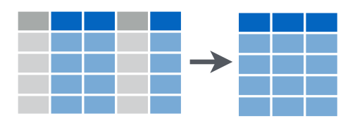

```{r setup, include=FALSE}
knitr::opts_chunk$set(
  echo = TRUE, tidy = FALSE, 
  size = "small",
  cache.path = "cache/dplyr-",
  cache = TRUE,
  fig.align = "center",
  comment = NA
  )
require(mosaic)
require(NHANES)
require(babynames)
require(nycflights13)
require(tidyr)
require(readr)
require(humanparser)
options(width = 55)
theme_set(theme_minimal())
set.seed(12345)
# edit tex file to add t option to beamer class to get vertical centering
```

## Tidy (Rectangular) Data 

**General Form**

 * rows = cases/observational units
 * columns = variables  
 * no exceptions
 
**For plotting**

 * row for each mark on the plot (cases = marks)
 * columns contain information needed to determine position, color, size, shape, etc.

**Many other reasons to want tidy data**

## Other names for rectangular data

 * tabular data
 * data table
 * data frame
 * tibble

Note: 

 * In R, a data frame is a particular class of container used to store
this sort of data.

 * `dplyr` functions produce tibbles which can be data frames plus
 some additional information or an abstraction of a data base connection.

## Data Verbs

`dplyr` works primarily by defining a set of **data verbs**

### A data verb is a function that 

 * takes data table as its first argument
 * returns a data table
 
Data table may be a data frame or a tibble.

## Five Main Data Verbs

Data verbs take data tables as input and give data tables as output

 1. `filter()`: subsets *cases* (i.e. rows)
 2. `select()`: subsets *variables* (i.e. columns)
    * `matches()`, `starts_with()`, `ends_with()`
 3. `mutate()`: creates new variables 
 4. `arrange()`: reorders the cases
 5. `summarize()`: reduce to a single row (summary stats)
    * `n()`: number of observations in the current group

## Chaining Syntax

The pipe syntax (`%>%`) provides an alternative syntax that works well
for sequential operations on data.

- `x %>% f(y)` is the same as `f(x, y)`

- `y %>% f(x, ., z)` is the same as `f(x, y, z)`

Read `%>%` as "then"

```{r, eval = FALSE}
# do verb1, then verb2, then verb3
data %>%
  verb1(arguments1) %>%
  verb2(arguments2) %>%
  verb3(arguments3) 
```

## Little Bunny Foo Foo

> Little bunny Foo Foo  
Went hopping through the forest  
Scooping up the field mice   
And bopping them on the head.   

## Chaining

**Foo Foo without chaining**

```{r, eval = FALSE}
bop( 
  scoop(
    hop(foo_foo, through = forest),
    up = field_mice), 
  on = head )
```


## Chaining

**Foo Foo with chaining**

```{r, eval = FALSE}
 foo_foo %>%
  hop(through = forest) %>%
  scoop(up = field_mouse) %>%
  bop(on = head)
```

**Foo Foo without chaining**

```{r, eval = FALSE}
bop( 
  scoop(
    hop(foo_foo, through = forest),
    up = field_mice),
  on = head )
```

## Time for Some Examples

This will give you access to the data used in the examples below.

```{r message=FALSE, warning=FALSE}
require(babynames)
require(NHANES)
require(nycflights13)
Babynames <- babynames  # change to capitalized version
```

## Babynames

Number of US children given each name (minimum five children) each year since 1880.
[`r round(nrow(Babynames)/1e6, 1)` M rows; `r round(sum(~n, data = Babynames)/1e6, 1)` M kids]

```{r}
Babynames %>% head()
```


## NHANES Data

Roughly equivalent to a random sample of 10,000 Americans.  

 * Actually created by a weighted random sampling from raw data 

\tiny

```{r, R.options = list(width = 100)}
require(NHANES)
names(NHANES)
```

\normalsize

## NYC flights

Several data tables providing information on all US flights into and out of 
JFK, EWR, and LGA in 2013.  (Part of a larger data base that includes all
US flights since 1987.)

```{r}
require(nycflights13)
names(flights)
```
Other data sets: `airlilnes`, `planes`, `airports`, `weather`

## 1. filter():  subsets *cases* 


```{r fig.width=5, fig.height=3}
CollegeAge <- 
  NHANES %>% filter(Age %in% 18:22)
Smokers <- 
  NHANES %>% filter(SmokeNow == "Yes")
```

## 1. filter():  subsets *cases* 


```{r}
CollegeSmokers <- 
  NHANES %>% 
  filter(Age %in% 18:22) %>%
  filter(SmokeNow == "Yes")
CollegeSmokers2 <- 
  NHANES %>% filter(Age %in% 18:22, SmokeNow == "Yes")
AttendedCollege <-
  NHANES %>% 
  filter(Education %in% c("Some College", "College Grad"))
```

## Variations on filter()

Like `filter()` these all return a subset of the **rows** of the data table

 * `distinct()`: returns the **unique** rows in a table
 * `sample_n()`: returns **random** rows (specify number)
 * `sample_frac()`: returns **random** rows (specify fraction)
 * `head()`:  grab the **first** few rows
 * `tail()`: grab the **last** few rows
 * `top_n()`: top few after sorting by a variable

## Examples of filter() and friends

Because the `NHANES` data set was created using random sampling with
replacement to mimic the probability sample used when the raw data were
gathered, some of the rows are duplicates:

```{r}
NHANES %>% 
  distinct() %>%
  nrow()
NHANES %>% nrow()
```


## Examples of filter() and friends

`top_n()` is useful for finding the extremes in the data

```{r}
Babynames %>% top_n(2, prop)
Babynames %>% top_n(2, n)
```

## Bottom's up

```{r}
Babynames %>% top_n(2, -n)  # trick for bottom n
```

## 2. select(): subsets *variables*



## 2. select(): subsets *variables*

Variables related to questions about sleep.

```{r}
NHANESsleep <- 
  NHANES %>% 
  select(Gender, Age, Weight, Race1, Race3, 
         matches("Sleep"), matches("TV"))
NHANESsleep %>% names()
NHANESsleep %>% dim()
NHANES %>% dim()
```

Note: `names()` and `dim()` are not data verbs so the terminate our chain 
of data table transformations.

## 3. mutate(): create new variables


## 3. mutate(): create new variables

```{r }
NHANESsleep %>% 
  mutate(Weightlb = Weight*2.2) %>% 
  select(Weight, Weightlb) %>% 
  top_n(3, Weight)    # we will get 4 because of ties
```


## 3. mutate(): create new variables

Variations

  * reuse variable name to replace
  * use `rename()` to rename varables
  * `transmute()` only keeps variables mentioned (`mutate()` + `select()`)
 
```{r}
NHANES %>% 
  transmute(Weightlb = Weight * 2.2) %>%
  sample_n(2)
```

## 4. arrange(): reorder the rows

```{r}
NHANES %>% 
  distinct() %>%
  mutate(Weightlb = 2.2 * Weight) %>%
  select(Age, Gender, Weightlb) %>%
  arrange(-Weightlb) 
```

## 5. summarise(): 1-row summary 


```{r}
# number of people (cases) in NHANES
NHANES %>% summarise(n())
nrow(NHANES)
```

## 5. summarize(): 1-row summary

Can have multiple columns in our 1-row summary

```{r}
NHANES %>% 
  mutate(Weightlb = Weight * 2.2) %>% 
  summarise(
    n = n(),
    mean_weight = mean(Weightlb, na.rm=TRUE),
    mean_age = mean(Age, na.rm = TRUE))
```


## Grouping

The `dplyr` tools become much more powerful in combination with grouping

 * `group_by()`: successive functions are applied within groups
 * `ungroup()`:  remove all groups
 * `groups()`: show the current grouping
 
## summarize() with group_by()


```{r}
NHANES %>% 
  mutate(Weightlb = Weight * 2.2) %>% 
  group_by(Education) %>%
  summarise(
    n = n(), mean_weight = mean(Weightlb, na.rm=TRUE),
    mean_age = mean(Age, na.rm = TRUE)) %>%
  arrange(mean_weight) %>% data.frame()
```

 

## Your Turn 

When starting, it can be helpful to work with a subset of the data.  When you have your data wrangling statements in working order, shift to the entire data table.

```{r}
OldBabies <-
  Babynames %>%
  filter(year < 1885) 
dim(OldBabies)
names(OldBabies)
```


## How many babies are represented?

## How many babies are represented?

```{r, eval=FALSE}
OldBabies %>%
  summarise(total = ????) 
```

## How many babies are represented?

```{r, eval=FALSE}
OldBabies %>%
  summarise(total = ????) 
```

```{r}
OldBabies %>%
  summarise(total = sum(n))
```

Note:  This doesn't include babies with rare names or people who were not registered
with SSA.

## How many babies are there in each year?

```{r eval=FALSE}
OldBabies %>% 
  group_by(????) %>% 
  summarise(total = ????)
```

## How many babies are there in each year?

```{r}
OldBabies %>% 
  group_by(year) %>% 
  summarise(total = sum(n))
```

## How many distinct names in each year?

```{r eval=FALSE}
OldBabies %>%
  group_by(????) %>%
  summarise(name_count = n_distinct(????))
```

## How many distinct names in each year?

```{r}
OldBabies %>%
  group_by(year) %>%
  summarise(name_count = n_distinct(name))
```

## How many distinct names in each year?

```{r eval=FALSE}
OldBabies %>%
  group_by(????, ????) %>%
  summarise(????)
```

## How many distinct names?

```{r}
OldBabies %>%
  group_by(year) %>%
  summarise(names = n(), 
            distinct_names = n_distinct(name), 
            duplicates = names - distinct_names)
```


## Track the yearly number of Hillarys.

```{r}
Hillary <-
  Babynames %>%
  filter(name == "Hillary")
```

## Plot the results

```{r}
Hillary %>%
  ggplot(aes(x = year, y = prop, colour = sex)) +
  geom_line() + 
  geom_vline(xintercept = 1992, colour = "navy")
```

## Some Exercises for you to try

 1. Plot a set of related names over time.
 
 2. Find the year in which your name was most popular.
 
 3. Find the largest year-over-year change in popularity for a name.
 
 4. Look for trends in first letters of names over time.
 
 5. Look for trends in the length of names over time.  (`nchar()` is useful)
 

## tidyr

The `tidyr` package provides some additional data verbs, including

  * `gather()`: turn rows and variable names into columns of data
  * `spread()`: turns columns into rows and names
  * `separate()`: split up one variable into multiple variables


```{r}
require(tidyr)
```

You can find more information on this topic at
[http://garrettgman.github.io/tidying/](http://garrettgman.github.io/tidying/)


## WHO TB data

The `tidyr` package includes a data frame of WHO data on new cases of TB for 212
countries over 34 years (with lots of missing data).

```{r warning=FALSE, message=FALSE}
data(who)
names(who)
```

## The "data in names" problem

For many purposes, this is not a convenient form for the data.  Here are some questions
that are challenging or awkward to answer with the data as they are:

 * Which countries provided data in which years (for each country and year we need to look 
 in `r ncol(who) - 4` columns to check whether any of them have data)
 * How is the total number of new TB cases changing (for particular countries) over time?
 * Does (reported) TB affect men and women in equal numbers?
 * Which categories represent that largest fraction of new cases (in a given year and country)?

## The "data in names" problem

In particular, the variable names are storing a kind of data that we might prefer to 
have stored inside the data table so that we can use our data operations on it.  

Each variable that begins `new` contains information on

  * diagnosis method (`rel` = relapse, `sn` = negative pulmonary smear, `sp` = positive pulmonary smear, `ep` = extrapulmonary)
  * sex (`f` = female, `m` = male)
  * age group (`014` = 0 to 14, `1524` = 15 to 24, `2534` = 25 to 34, `3544` = 35 to 44, etc.)

## Ack: the names are not consistent

Some of the names begin `new_` and some omit that `_` and the oldest group is
coded awkwardly.  We could fix that here by modifying the names, but we'll do
it a little later.

```{r}
head(names(who), 9)
tail(names(who), 9)
```

## gather(): turn rows into columns

```{r}
whoLong <- 
  who %>% 
  gather("key", "count", 5:60)
whoLong %>% sample_n(10)
```

## separate()

```{r}
whoLong <- 
  who %>% 
  gather("key", "count", 5:60) %>%
  # fix inconsistencies naming scheme 
  mutate(key = sub("new[^_]", "new_", key)) %>% 
  mutate(key = sub("65", "6599", key)) %>% 
  separate(key, c("new", "diagnosis", "sexage"), 
           sep = "_")
```

## separate():  sanity check

```{r}
whoLong %>% 
  group_by(year, diagnosis, sexage) %>% 
  summarise(n_items = n()) %>% 
  group_by(n_items) %>% 
  summarise(n_countries = n() / (ncol(who) - 4))
```

## separate():  sanity check

```{r}
who %>% group_by(year) %>% 
  summarise(n_countries = n()) %>%
  group_by(n_countries) %>% 
  summarise(n_years = n()) 
```

## separate(): putting it all together

```{r}
whoLong <- 
  who %>% 
  gather("key", "count", 5:60) %>%
  mutate(key = sub("new[^_]", "new_", key)) %>%  
  mutate(key = sub("65", "6599", key)) %>%       
  separate(key, c("new", "diagnosis", "sexage"), 
           sep ="_") %>%
  separate(sexage, c("sex", "age"), sep = 1) %>%
  separate(age, c("age_lo", "age_hi"), 
           sep = -3, remove = FALSE)
```

## separate(): putting it all together
```{r}
whoLong %>% sample_n(5) %>% select(-country, iso2) 
```

## Men vs Women

Now we can investigate one of our questions.

```{r, warning = FALSE, message = FALSE, fig.height = 1.5}
TBfemale <- 
  whoLong %>%
  group_by(country, iso3, sex) %>%
  summarise(tb = sum(count, na.rm = TRUE)) %>%
  group_by(country, iso3) %>%
  mutate(total_tb = sum(tb, na.rm = TRUE)) %>%
  ungroup() %>%
  filter(sex == "f") %>%
  mutate(prop.women = tb / total_tb) 
```

## Men vs Women

```{r, warning = FALSE, message = FALSE, fig.height = 1.8}
TBfemale %>%
  ggplot(aes(x = prop.women)) +
  geom_histogram() + geom_vline(xintercept = 0.5) +
  xlab("proportion of new TB cases that are female")
```

## Who are the outlier nations?

In most countries, TB is more commonly reported in men.  But there are some exceptions.

```{r}
TBfemale %>%
  select(-country) %>%
  arrange(-prop.women) %>% head(5)
```

## Afghanistan is interesting

The other outlier countries don't have many cases.
Let's look at Afghanistan.

```{r, fig.height = 1.8}
whoLong %>%
  group_by(country, iso3, year, sex) %>%
  summarise(tb = sum(count, na.rm = TRUE)) %>%
  filter(country == "Afghanistan") %>%
  ggplot() +
  geom_line(aes(x = year, y = tb, colour = sex))
```

## unite() -- reverse of separate()

We can combine multiple columns into a single column with `unite()`.

```{r}
whoLong %>% select(-new, -age) %>%
  unite(category, diagnosis, sex, age_lo, age_hi) %>% 
  sample_n(4)
```
## spread()

We can use spread to take columns and spread them out into rows, making our data wider.
For example, we might like to have a single row that gives information about both 
male and female names.


```{r}
Babynames %>%
  select(year, name, n, sex) %>%
  spread(sex, n) %>% 
  sample_n(3)
```

## Two-way names

This makes it easy to identify common "two-way names".

```{r}
TwoWayNames <-
  Babynames %>%  select(year, name, n, sex) %>%
  spread(sex, n) %>% 
  filter(F > 0, M > 0) 
TwoWayNames %>% 
  arrange( - pmin(F, M)) %>%
  head(4)
TwoWayNames %>% 
  group_by(name) %>%
  summarise(F_total = sum(F), M_total = sum(M)) %>%
  arrange( - pmin(F_total, M_total)) %>%
  head(4)
```  


## Combining data from multiple sources

```{r warning=FALSE, message=FALSE}
require(nycflights13)
```

**The NYC Airlines data has (2013) data on each**

  * flight [`flights`]
  * airport [`airports`]
  * airline [`airlines`]
  * plane [`planes`]
  * time/airport [`weather`]


## The NYC Airlines data

```{r}
names(flights)
names(airports)
names(airlines)
names(weather)
names(planes)
```

## join add aircraft information to flight data

```{r}
flights %>% select(carrier, flight, tailnum, origin, dest) %>% head()
planes %>% select(tailnum, year, model, seats) %>% head()

flights %>% 
  inner_join(planes, by = "tailnum", suffix = c("_flight", "_plane")) %>% 
  names()
```

## x %>% join(y)

```{r}
# inner_join: only rows in x that have a match in y
flights %>% inner_join(planes, by="tailnum") %>% dim()

# left_join: all rows from x (NA's when no match)
flights %>% left_join(planes, by="tailnum") %>% dim()

# right_join: all rows from y (NA's when no match)
flights %>% right_join(planes, by = "tailnum") %>% dim()

# full_join: all rows from both x and y (NA's when no match)
flights %>% full_join(planes, by = "tailnum") %>% dim()
```

## anti_join(): How many have no match?

```{r}
# anti_join: return all rows from x that have no match in y
# only columns from x are used
flights %>% anti_join(planes, by = "tailnum") %>% nrow()
```

## anti_join(): What has no match?

```{r}
flights %>% anti_join(planes, by = "tailnum") %>% 
  left_join(airlines) %>%
  group_by(carrier, name) %>%
  summarise(n = n()) %>% arrange(-n)
```

## Exercises

 1. Which is more likely to have more than a 30-minute departure delay, a smaller 
 plane or a larger plane?
 
 2. How many different planes flew between GRR and NYC?  Which one flew most often?
 
 3. Did any planes fly for multiple carriers during 2013?
 
 4. Are older planes more likely to have delays?
 
 5. How do the ages of the planes vary by carrier?
 
 6. Are there any flights among the three NYC airports?  
 
 7. How large are the planes that make direct flights to/from GRR?
 
 8. American Airlines had a lot of tail numbers not in `planes`.  What fraction
 of AA flights are in this category?
 

## lubridate: working with dates

```{r warning=FALSE, message=FALSE}
require(lubridate)

rightnow <- now()
rightnow

day(rightnow)
week(rightnow)
month(rightnow, label = FALSE)
month(rightnow, label = TRUE)
year(rightnow)

minute(rightnow)
hour(rightnow)

yday(rightnow)
mday(rightnow)
wday(rightnow, label = FALSE)
wday(rightnow, label = TRUE)
wday(rightnow, label = TRUE, abbr = TRUE)
```

## lubridate

Arithmetic with lubridate

```{r}
jan31 <- ymd("2013-01-31")
jan31 + months(0:11)

floor_date(jan31, "month") # round down to the nearest month
floor_date(jan31, "month") + months(0:11) + days(31)
jan31 + months(0:11) + days(31)

#Add and subtract months to a date without exceeding the last day of the new month 
jan31 %m+% months(0:11)
```

## readr::parse_number()

```{r message=FALSE, warning=FALSE}
require(readr)
parse_number("$1,200.34")
parse_number("-2%")

# The heuristic is not perfect - it won't fail for things that
# clearly aren't numbers
parse_number("-2-2")
parse_number("12abc34")
```

## humanparser

This also isn't perfect, but can handle a fairly wide range of names.
```{r}
require(humanparser) 
Names <- c("Rip Van Winkle", "Fred Flintstone", 
           "John Q. Public", "Oscar De La Hoya")
parse_names(Names)
```

