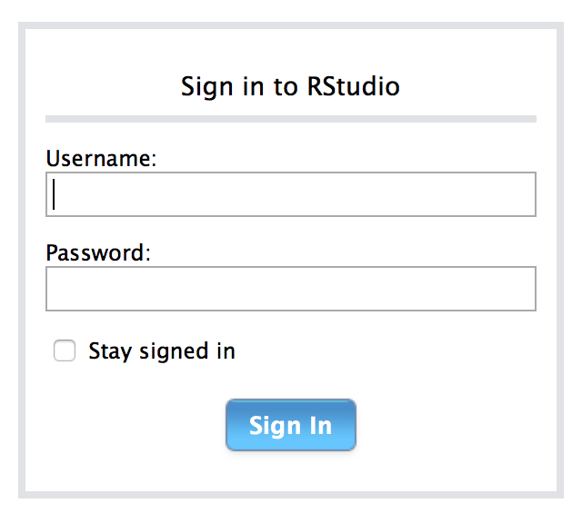
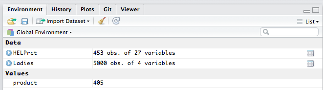
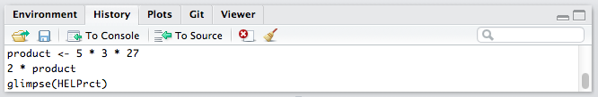
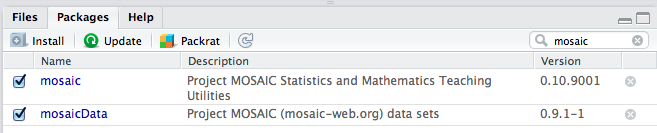
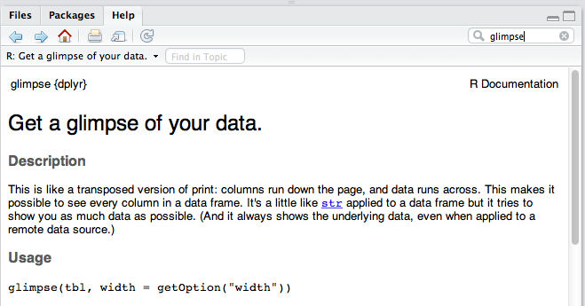

```{r setup, include=FALSE}
library(learnr)
knitr::opts_chunk$set(echo = TRUE)
```


## Access to RStudio Sever

  * [rstudio.calvin.edu](http://rstudio.calvin.edu:8787)
  
    * Change my password @ [https://cs.calvin.edu/sysadmin/linux-passwordreset.php](https://cs.calvin.edu/sysadmin/linux-passwordreset.php)

<center>

</center>

## Menu

  * Files, Edit, Code, View, etc.
  * Tools > Options for customization
  
    * emacs/vi users: choose key bindings
    * don't like auto-insertion of parens?  You can turn it off.
    
    
## Projects

 * A project is a folder plus some settings (saved in a project file).
 
 * You should **always work in a project**.
    
    * Create one now:  **File** > **New Project** or clik on current project in upper right corner.
    
    * Use a **New Folder** (name it whatever you like)
 

 
 * Projects can be shared (great for student work groups)
 

## Panes and Tabs

  * 4 **panes** (but some may be minimized).
  * Each pane can have multiple **tabs**.
  * Options let you decide which tabs go in which panes.


 
## The Console -- ephemeral, interactive commands 


### Using R in the console

 * **Most of your works should be done somewhere else** (stay tuned)
 
 * Remember: R is **case sensitive**

    * many students are *not* case sensitive

 * **Arrows and Tab**

    * up/down arrows scroll through history
    * TAB completion can simplify typing

 * If all else fails, try **ESC**

    * If you see a + prompt, it means R is waiting for more input
    * If this is unintentional, you probably have a typo
    * ESC will get you pack to the command prompt

## Caclulation and Assignment { .smaller }

  * Basic calculation is similar to a calculator
  * Results can be stored in named variables with `<-` (or `->`)
  

```{r}
product <- 5 * 3 * 27
product
```
```{r}
sqrt(100)
log10(product)
```

## Multiple Projects

 * It is easy to switch between projects, or to have multiple projects open at once.
 
    * Give it a try.  Create a second project and switch between your projects.
    
    * I have dozens of projects (one for each course, each project, each talk, each package, etc, etc.)
    
    * Projects can be associated with GitHub repositories
    
    
## Environment Tab

  * Shows the objects in the working environment
  * Broom icon clears the working environment
  


## History Tab

  * Searchable list of previous commands
  * Commands can be copied to console or to files




## Packages Tab

  * List all installed packages
  * Install new packages
  * Load/unload packages by clicking check boxes
  * Click on name of package to find documentation, vignettes, and other info
  


## Help!

RStudio provides several ways to get help

 * Help tab documents functions and data sets in packages
 * `?` followed by name of function or data set
 * Package vignettes
 * TAB completion provides useful hints
 


## Loading data

### If you are using R Studio server

  1. Get your data onto the server.
  
    a. In the **Files** tab, navigate to the folder on the server where you want your file to be.
    
    b. In the **Files** tab, choose **Upload** and navigate to your file.
 
  2. Get your data into R
  
    a. In the **Environment** tab, choose **Import Dataset**
    
 
### If you are using R Studio desktop

  1. Skip step 1 above (no need to upload data to server).
  
  2. Do Step 2 as above (**Import Dataset**).


### Importing online data

  * **Import Dataset** allows you to provide a URL.
  
  * For Google sheets: Use the `googlesheets` package.

### Data in other formats

  * The `haven` and `foreign` packages provide functions for importing data in many different formats.
  
  * The `XML` and `xml2` package has tools for parsing XML and collecting data (useful for web scraping).
 

## File Tabs

 * R Studio provides an editor that can edit several kinds of text files.
 * **File** > **New File** >  

## Other stuff

  * **Git/SVN** integration
  
  * **Connections** tab for working with data base connections
  
  * **R Markdown** -- sane way to create documents with text and R
  
    * Multiple output formats (HTML, PDF, Word, tutorials)
    
    * [Prezi by Nick Horton](https://prezi.com/vq6l5yqpnqma/intro-to-r-markdown-cvc-2015/)
