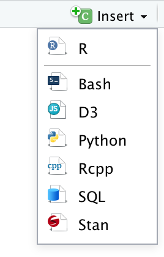
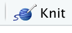

```{r setup, include=FALSE}
knitr::opts_chunk$set(
  fig.width = 12, 
  fig.height = 4,
  fig.align = "center",
  size = "small",
  echo = TRUE)
library(dplyr)
library(gapminder)
library(leaflet)
library(r2d3)
library(ggformula)
library(plotly)
library(mosaic)
library(pander)
library(knitr)
library(sp)
theme_set(theme_bw())
```

<style>
.foo {
  background-image: url(https://upload.wikimedia.org/wikipedia/commons/3/39/Naruto_Shiki_Fujin.svg);
}

.inverse {
  background-image: url(images/BDIorange-teal.jpg);
  background-size: cover;
}

.title-slide {
  background-image: url(images/BDIorange-teal.jpg);
  background-size: cover;
}
</style>


# Outline

0. Some Teasers

1. Some Quick and Easy Things (No D3 knowledge required)
    * maps
    * converting ggplot2 to javascript
    * using plotly directly
    * other htmlwidgets

2. If you know some D3, then ...
    * ... D3 chunks in R markdown are an easy way to mix R and D3.
    * you might like to write your own htmlwidget

---

class: center

## 15 Data Visualizations That Will Blow Your Mind

<https://blog.udacity.com/2015/01/15-data-visualizations-will-blow-mind.html>

<iframe width = 900 height = 470 src = "https://blog.udacity.com/2015/01/15-data-visualizations-will-blow-mind.html"/>


---

class: center

## Visualizing US Gun Deaths

<br>

<https://guns.periscopic.com/?year=2013>

<!-- <iframe width = 900 height = 470 src = "https://guns.periscopic.com/?year=2013"> -->

---

## Some Famous Data

```{r, warning = FALSE}
data(gapminder, package = "gapminder")
gapminder <-  gapminder %>% 
  mutate(
    iso = mosaic::standardCountry(country),         # standard ISO codes for countries
    pop = round(pop / 1e6, 2),                      # population in millions
    gdpPercap = round(gdpPercap / 1000, 2))         # GDP in 1000s of $
G2007 <- gapminder %>% filter(year == 2007)
```

```{r echo = FALSE}
G2007 %>% DT::datatable(options = list(pageLength = 5))
```

---

## magrittr Pipes (a.k.a. Then Operator)

In case you haven't seen `%>%` before, the following are *almost* equivalent:

```{r, eval = FALSE}
f(x, a)
x %>% f(a) 
```

--

More interesting example:

```{r, eval = FALSE}
x %>% f(a) %>% g(b1, b2) %>% h(c)
h(g(f(x, a), b1, b2), c)
```

---

## Little Bunny Foo Foo

Little bunny Foo Foo  
Went hopping through the forest  
Scooping up the field mice  
And bopping them on the head.  

--

### Without chaining

```{r, eval = FALSE}
bop(scoop(hop(foo_foo, through = forest), up = field_mice), on = head)
```

--

### With chaining

```{r, eval = FALSE}
foo_foo %>%
  hop(through = forest) %>%
  scoop(up = field_mice) %>%
  bop(on = head)
```

---

### Advantages of Chaining

Chaining

* reduces parenthesis chasing
* keeps arguments near functions
* mirrors order of operations (making code easier to read)
* facilitates code editing (easy to eliminate or insert a step)

---

class: inverse middle center

# Quick and Easy #1: Maps with leaflet

---

## Simple maps with leaflet

A simple interactive map can be created by specifying a location and zoom level.

```{r}
library(leaflet)

leaflet() %>% setView(-85.6721, 42.9683, 16) %>% addTiles() 
```

---

## Adding additional shapes

Since our data are global in scope let's start with a slightly wider view.
We can get country borders in JSON format and highlight them with `addPolygons()`. 

```{r, eval = FALSE}
map_url <- 
  "https://raw.githubusercontent.com/johan/world.geo.json/master/countries.geo.json"
world_map <- geojsonio::geojson_read(map_url, what = "sp")
m <- leaflet(world_map) %>% setView(0, 0, 1) %>% addTiles()  
m %>% addPolygons(weight = 1)  # default is 5 -- way too thick #<<
```

```{r echo = FALSE, eval = TRUE}
# save(world_map, file = "world_map.Rdata")
load("world_map.Rdata")
m <- leaflet(world_map) %>% setView(0, 0, 1) %>% addTiles()  
m %>% addPolygons(weight = 1)  # default is 5 -- way too thick #<<
```

---

## Adding some data to our map

We can join additional information to our map using a dplyr join function.

```{r, message = FALSE, warning = FALSE}
world_map@data <-
  world_map@data %>% 
  left_join(G2007, by = c("id" = "iso"))    # join gapminder data   #<<
```

--

A color scale for the 5 quintiles of GDP per capita

```{r}
bins <- quantile(world_map$gdpPercap, probs = (0:5)/5, na.rm = TRUE)

color_scale <-  colorBin("YlOrRd", 
                         domain = world_map$gdpPercap, 
                         bins   = bins)
color_scale(c(1, 2, 5, 10))
```

---

## Adding colors to the map

```{r}
m <- leaflet(world_map) %>%  setView(0, 0, 1) %>% addTiles()
m %>%
  addPolygons(
    weight = 1, opacity = 1, color = "navy", 
    fillColor = ~ color_scale(gdpPercap), fillOpacity = 0.4  #<<
  )
```

---

## Adding mouseover

```{r}
m %>%
  addPolygons(
    weight = 1, opacity = 1, color = "navy", 
    fillColor = ~ color_scale(gdpPercap), fillOpacity = 0.4,  
    highlight =                                                             #<<
      highlightOptions(weight = 2, fillOpacity = 0.9, bringToFront = TRUE)  #<<
  )
```

---

## Preparing some text labels for tooltips

When we hover over country, we would like to see some information about that country.
We can use HTML to make things look nice.

```{r}
# create some HTML labels
labels <- 
  sprintf(
    "<strong>%s</strong><br/>GDP per capita: %g<br/>life exp: %g",
    world_map$name, world_map$gdpPercap, world_map$lifeExp
  ) %>% lapply(htmltools::HTML)
```

---

## Adding tooltips

```{r}
m %>%
  addPolygons(
  weight = 1, opacity = 1, color = "navy", 
  fillColor = ~ color_scale(gdpPercap), fillOpacity = 0.4,
  highlight = 
    highlightOptions(weight = 2, fillOpacity = 0.9, bringToFront = TRUE),
  label = labels   #<<
  )
```

```{r include = FALSE}
# ,
#   labelOptions = labelOptions(
#     style = list("font-weight" = "normal", padding = "3px 8px"),
#     textsize = "15px", direction = "auto"))
```

---

class: inverse middle center

# Quick and Easy #2: ggplot2 + ggplotly()

---

## Example plot

Here's a quick ggplot2 plot (using ggformula).

```{r}
library(ggformula)
gf_point(lifeExp ~ gdpPercap, data = G2007,
         color = ~ continent, size = ~pop, alpha = 0.4, show.legend = FALSE) %>%
  gf_refine(scale_x_log10())
```

---

## And now it is interactive!

We just need to add one call to `plotly::ggplotly()` to make our plot interactive.

```{r}
library(plotly)                          #<<
gf_point(lifeExp ~ gdpPercap, data = G2007,
         color = ~ continent, size = ~pop, alpha = 0.4, show.legend = FALSE) %>%
  gf_refine(scale_x_log10()) %>%
  ggplotly()                             #<<
```

---

## Improved interactivity

```{r}
library(plotly)
gf_blank(lifeExp ~ gdpPercap, data = G2007,
         color = ~ continent, size = ~pop, text = ~ paste("country:", country)) %>%
  gf_point(alpha = 0.6) %>%
  gf_refine(scale_x_log10()) %>%
ggplotly(tooltip = c("text", "colour"))     #<<
```

---

## Quick and Easy #2: ggplot2 + ggplotly()

### Summary

1. Very quick and easy

--

2. You get what you pay for

--
    * some annoying features (like duplicated info in tooltips)
    * doesn't always do what you want
    * may need to jump through some ggplot2 hoops to get closer to what you want
    * but often good enough for quick interactivity for personal use

---
class: inverse middle center

# Quick and Easy #3: plotly without ggplot2

---

## Quick and Easy #3: plotly without ggplot2

Part of the trouble with #2 is that things have to be inferred from what ggplot2
stores in the plot object (and translated to json/javascript).

But we can also use plotly "natively" and avoid the translation step.

  * downside: need to learn a new plotting system
  * fortunately: it is pretty similar to ggformula
  
---

## plot_ly example

```{r, warning = FALSE, message = FALSE}
plot_ly(data = G2007, type = "scatter", alpha = 0.4,
        x = ~ gdpPercap, y = ~ lifeExp, color = ~ continent, size = ~ pop) %>%
  layout(xaxis = list(type = "log"))
```

---

## Adding tooltip info with text = 

```{r, warning = FALSE, message = FALSE}
plot_ly(data = G2007, type = "scatter", alpha = 0.4,
        x = ~ gdpPercap, y = ~ lifeExp, color = ~ continent, size = ~ pop,
        text = ~country) %>%                     #<<
  layout(xaxis = list(type = "log"))
```

---

## Animating multiple years

```{r, warning = FALSE, message = FALSE}
plot_ly(data = gapminder, type = "scatter", alpha = 0.4, text = ~country, 
        x = ~ gdpPercap, y = ~ lifeExp, color = ~ continent, size = ~ pop,
        frame = ~ year) %>%                     #<<
  layout(xaxis = list(type = "log")) 
```
 
---
 
## HTML Widgets

**leaflet** and **plotly** are examples of htmlwidget packages

* relatively easy to wrap javascript (including D3) in R functions
* user never needs to see any javascript

---

## HTML Widgets

**leaflet** and **plotly** are examples of htmlwidget packages

Gallery at <http://gallery.htmlwidgets.org/>
    
<iframe src = "http://gallery.htmlwidgets.org/" width = "800" height = "400">
         Sorry your browser does not support inline frames.
</iframe>
      
---

class: center middle inverse

# Embedding D3 in RMarkdown

---

## Embedding D3 in RMarkdown

### Short version

* **r2d3** package takes care of converting R data into JSON
* pass the data to D3 with **data argument of d3 chunk header**
* write D3 code to create visualization in a **container named `svg` or `div`**.

--

### Minimal Example

````python
`r ''````{r, include = FALSE}
# load r2d3 package
library(r2d3)
```

`r ''````{d3, data = my_data}
// javascript code goes here
svg.selectAll("circle")
  .data(data)     # pass in my_data (in JSON format)         
```
````

---

## RStudio support

- Create a new R Markdown document from the menu `File -> New File -> R Markdown` 

- RStudio allows you to insert D3 chunks from the chunk insertion menu.

```{r echo = FALSE, fig.align = "center", out.height = "200px", out.width = "120px"}

```


- Click the `Knit` button to compile the Rmarkdown to HTML

```{r echo = FALSE, fig.align = "center", out.height = "75px", out.width = "120px"}

```

---

```{r, include = FALSE}
my_options <- 
  with(G2007, 
       list(
         xrange     = extendrange(gdpPercap, f = 0.10), 
         yrange     = extendrange(lifeExp),
         poprange   = extendrange(pop),
         continents = sort(as.character(unique(continent)))
  ))
my_options
```

## A more interesting example

D3 chunk:

```{d3, data = G2007, height = 400, width = 800, d3_version = 5, eval = FALSE}
var x_scale = d3.scaleLog().domain([.150, 50.000]).range([0, width]);
var x_axis  = d3.axisBottom().scale(x_scale);

var y_scale = d3.scaleLinear().domain([30, 100]).range([height, 0]);
var y_axis  = d3.axisLeft().scale(y_scale);

var size_scale  = d3.scaleSqrt().domain([.2, 1500]).range([7, 30]);
var color_scale = d3.scaleOrdinal(d3.schemeCategory10)
  .domain(d3.extent(data.map( d => d["pop"])));

svg.selectAll("circle")                     
  .data(data) .enter() .append("circle")   
  .attr("fill", d => color_scale(d.continent)).attr("fill-opacity", 0.4)
  .attr("stroke", d => color_scale(d.continent)).attr("opacity", 0.9)
  .attr("cx", d => x_scale(d.gdpPercap))
  .attr("cy", d => y_scale(d.lifeExp))
  .attr("r",  d => size_scale(d.pop));
  
svg.append("g").attr("transform", "translate(0," + (height - 50) + ")").call(x_axis);
svg.append("g").attr("transform", "translate(25, 0)").call(y_axis);


```

---

## A more interesting example

```{d3, data = G2007, height = 400, width = 800, d3_version = 5, echo = FALSE, results = "asis"}
var x_scale =     d3.scaleLog().domain([.150, 50.000]).range([0, width]);
var x_axis = d3.axisBottom().scale(x_scale);

var y_scale =  d3.scaleLinear().domain([30, 100]).range([height, 0]);
var y_axis = d3.axisLeft().scale(y_scale);

var size_scale = d3.scaleSqrt().domain([.2, 1500]).range([7, 30]);
var color_scale = d3.scaleOrdinal(d3.schemeCategory10)
  .domain(d3.extent(data.map( d => d["pop"])));

svg.selectAll("circle")
  .data(data) .enter() .append("circle")
  .attr("fill", d => color_scale(d.continent)).attr("fill-opacity", 0.6)
  .attr("stroke", d => color_scale(d.continent)).attr("opacity", 0.9)
  .attr("cx", d => x_scale(d.gdpPercap))
  .attr("cy", d => y_scale(d.lifeExp))
  .attr("r",  d => size_scale(d.pop))
  .on("mouseover", hilite)
  .on("mouseout",  unhilite);
  
svg.append("g").attr("transform", "translate(0," + (height - 50) + ")").call(x_axis);
svg.append("g").attr("transform", "translate(50, 0)").call(y_axis);

function hilite(d, i) {  
  d3.select(this).attr("fill-opacity", 0.9);
  svg.append("text")
    .attr("id", d.country)
    .attr("x", 100)
    .attr("y", 50)
    .attr("fill", color_scale(d.continent))
    .text(function() {return  d.country + ": population " + d.pop + " million"; });
}
            
function unhilite(d, i) {  
  d3.select(this).attr("fill-opacity", 0.4);
  svg.selectAll("text").remove();  // Remove text 
}
```

---

## Working in a div


If we add `container = "div"` to the chunk header, we can work in a div, which allows us to 
add HTML elements outside of the svg graphical element.

```{d3 data = G2007, container="div", d3_version = "5", options = list(margin = list(top = 25, right = 25, bottom = 80, left = 50)), echo = FALSE}

let xvar = "gdpPercap";
let yvar = "lifeExp";
let color_var = "continent";
let size_var = "pop";
let inner_width = width - options.margin.left - options.margin.right;
let inner_height = height - options.margin.top - options.margin.bottom;

div
  .append("p").attr("id", "some-text")
  .text("A plot of " + yvar + " vs. " + xvar + ".")
  .style("color", "salmon")
  .style("font-family", "Helvetica,Arial,sans-serif")
  
var graphic = 
  div
   .append("svg")
     .attr("width", width)
     .attr("height", height)
   .append("g")
     .attr("transform", "translate(" + options.margin.left + "," + options.margin.top + ")");

graphic
  .append("rect")
    .attr("width", inner_width)
    .attr("height", inner_height)
    .attr("x", 0)
    .attr("y", 0)
    .attr("fill", "blue")
    .attr("opacity", 0.05);
    
var x_scale = d3.scaleLog()
  .domain(d3.extent(data.map(d => d[xvar])))
  .range([0, inner_width]);

var x_axis = d3.axisBottom().scale(x_scale);

var y_scale = d3.scaleLinear()
  .domain(d3.extent(data.map(d => d[yvar])))
  .range([inner_height, 0]);
  
var y_axis = d3.axisLeft().scale(y_scale);

var color_scale = d3.scaleOrdinal(d3.schemeAccent)
  .domain(d3.extent(data.map( d => d[color_var])));
  
var size_scale = d3.scaleSqrt()
  .domain(d3.extent(data.map(d => d[size_var])))
  .range([7, 30]);
  
graphic.selectAll("circle")
  .data(data)
  .enter()
  .append("circle")
  .attr("cx", d => x_scale(d[xvar]))
  .attr("cy", d => y_scale(d[yvar]))
  .attr("r",  d => size_scale(d[size_var]))
  .attr("fill", d => color_scale(d[color_var]))
  .attr("fill-opacity", 0.6)
  .attr("stroke", "black")
  .attr("stroke-opacity", 0.4);
  
graphic.append("g")
  .attr("transform", "translate(0," + inner_height + ")")
  .attr("id", "x-axis")
  .call(x_axis);
  
graphic.append("g")
  .attr("id", "y-axis")
  .call(y_axis);
```

---

## Code using a div

<style>
.scrollable {
    width: 950px;
    height: 450px;
    overflow-y: scroll;
    overflow-x:hidden;
}
</style>

<iframe width = 900, height = 500 src = "with-div-chunk.txt">


---

## Adding a drop-down menu

```{d3 data = gapminder, container="div", d3_version = "5", options = list(margin = list(top = 25, right = 25, bottom = 50, left = 50)), echo = FALSE}

let xvar = "gdpPercap";
let yvar = "lifeExp";
let color_var = "continent";
let size_var = "pop";
let inner_width = width - options.margin.left - options.margin.right;
let inner_height = height - options.margin.top - options.margin.bottom;

div
  .append("p")
  .attr("id", "some-text")
  .text("A plot of " + yvar + " vs. " + xvar + ".");
  
var years = d3.map(data, d => d.year).keys();

var selector = div.append("select").attr("id", "year")
  .on('change', function() {
    var year = d3.select(this).property('value');
    render_plot(year);
});

selector
  .selectAll("option")
  .data(years)
  .enter()
  .append("option")
  .attr("value", d => d)
  .text(d => d);
  
var graphic = 
  div
   .append("svg")
     .attr("width", width)
     .attr("height", height)
   .append("g")
     .attr("transform", "translate(" + options.margin.left + "," + options.margin.top + ")");

graphic
  .append("rect")
    .attr("width", inner_width)
    .attr("height", inner_height)
    .attr("x", 0)
    .attr("y", 0)
    .attr("fill", "blue")
    .attr("opacity", 0.02);
    
var x_scale = d3.scaleLog()
  .domain(d3.extent(data.map(d => d[xvar])))
  .range([0, inner_width]);
var x_axis = d3.axisBottom().scale(x_scale);

var y_scale = d3.scaleLinear()
  .domain(d3.extent(data.map(d => d[yvar])))
  .range([inner_height, 0]);
var y_axis = d3.axisLeft().scale(y_scale);

var color_scale = d3.scaleOrdinal(d3.schemeAccent)
  .domain(d3.extent(data.map(d => d[color_var])));
  
var size_scale = d3.scaleSqrt()
  .domain(d3.extent(data.map(d => d[size_var])))
  .range([7, 30]);

graphic.append("g")
  .attr("transform", "translate(0," + inner_height + ")")
  .attr("id", "x-axis")
  .call(x_axis);
  
graphic.append("g")
  .attr("id", "y-axis")
  .call(y_axis);


function render_plot(year) {
  
  var t = d3.transition().duration(2200);
  
  var circles = graphic.selectAll("circle")
    .data(data.filter(d => d.year == year));
   
  // remove 
  circles.exit().remove();
  
  // update 
  circles.transition(t)
    .attr("cx", d => x_scale(d[xvar]))
    .attr("cy", d => y_scale(d[yvar]))
    .attr("r",  d => size_scale(d[size_var]))
    .attr("fill", d => color_scale(d[color_var]))
    .attr("fill-opacity", 0.6)
    .attr("stroke", "black")
    .attr("stroke-opacity", 0.4);
   
  // add 
  circles.enter().append("circle").transition(t)
    .attr("cx", d => x_scale(d[xvar]))
    .attr("cy", d => y_scale(d[yvar]))
    .attr("r",  d => size_scale(d[size_var]))
    .attr("fill", d => color_scale(d[color_var]))
    .attr("fill-opacity", 0.6)
    .attr("stroke", "black")
    .attr("stroke-opacity", 0.4);
}

render_plot(1952);
  
```

---

## Code for drop-down menu example


<iframe width = 900, height = 500 src = "with-drop-down-chunk.txt">

---
class: inverse

## Summary

1. See if there is an exisiting html widget that will do your job.

2. If not, use D3 in Rmarkdown to create something custom.

3. If it looks reusable, create your own html widget

    a. Create a package.
    
    b. Use `htmlwidgets::scaffoldWidget()` to stub out basic widget.
    
    c. Drop JS code into appropriate folder
    
    d. Create R wrapper.
    
    e. Create JS wrapper.

---

class: center

## Creating htmlwidgets

<https://www.htmlwidgets.org/develop_intro.html>

<iframe width = "950px" height = "470px" src = "https://www.htmlwidgets.org/develop_intro.html">

---

class: center

## Example: leaflethex

<https://rpruim.github.io/leaflethex>

<iframe width = "950px" height = "470px" src = "https://rpruim.github.io/leaflethex/">

class: center 

---

class: center 

background-image: images/BDIorange-teal.jpg

# Thanks

Complete a 3-question survey about this session for a chance to win a $50 Amazon
gift card at the next welcome, keynote, or closing session!


```{r, echo = FALSE, fig.align = "center"}
library(qrcode)
qrcode::qrcode_gen("https://calvin.co1.qualtrics.com/jfe/form/SV_6VeKg1TmW3yuo8R")
```

<https://calvin.co1.qualtrics.com/jfe/form/SV_6VeKg1TmW3yuo8R>


