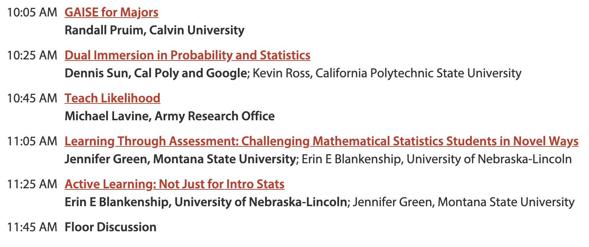
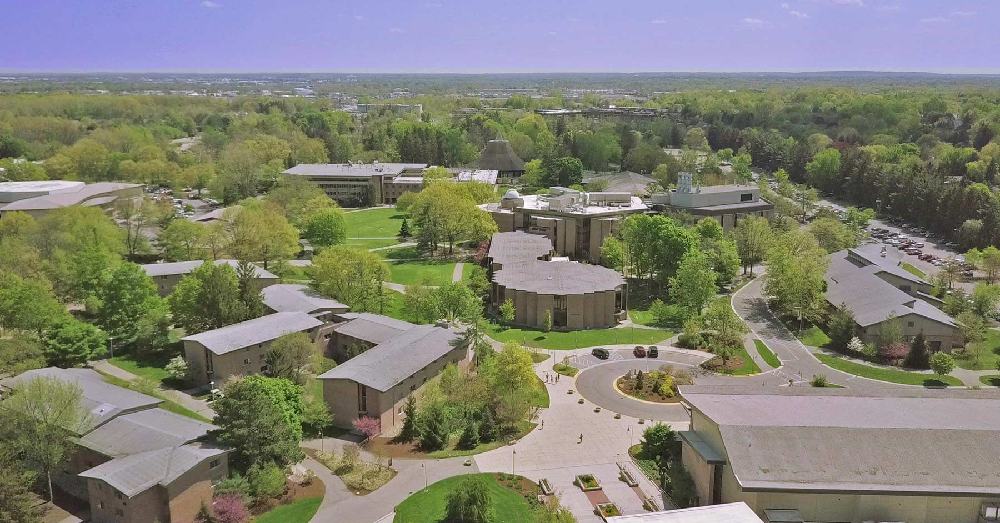
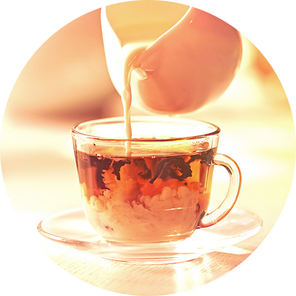
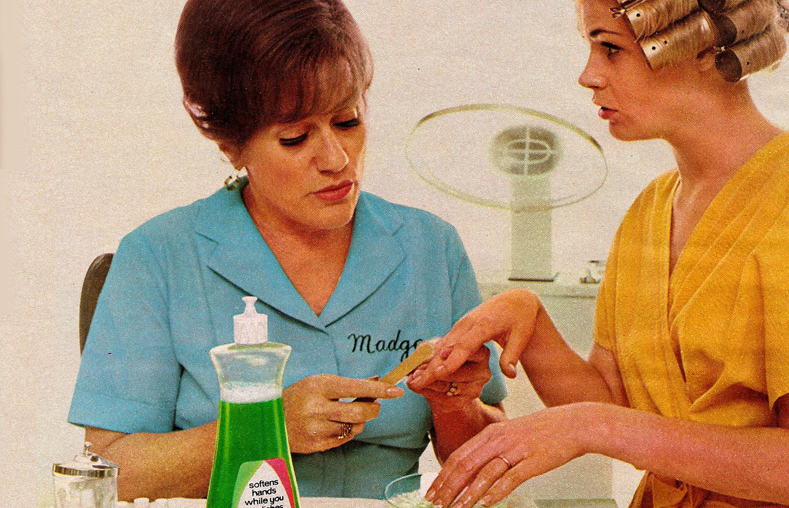

```{r setup, include=FALSE}
options(htmltools.dir.version = FALSE)
options(servr.daemon = TRUE)
knitr::opts_chunk$set(
  echo = TRUE,
  fig.width = 8,
  fig.height = 4,
  out.width = "70%"
  )
library(mosaic)
theme_set(theme_bw())
library(maxLik)
library(fastR2)
set.seed(20200804)
```

```{r xaringan-themer, include=FALSE, warning=FALSE}
library(xaringanthemer)
style_duo_accent(
  primary_color = "#1381B0",
  secondary_color = "#FF961C",
  inverse_header_color = "#FFFFFF"
)
```


<style>
.big-strong strong{
  font-size: 24px;
  color: forestgreen;
}

.jsm {
  // color: #943934;
  color: #c33526; 
  font-weight: 600;
  font-size: 24px;
}

</style>


## Modernizing the Mathematical Statistics Course

```{r echo = FALSE, out.width = "100%", fig.align="center"}

```

Post questions/comments in the session chat as we go along.

<!-- 10:05 AM	GAISE for Majors -->
<!-- Randall Pruim, Calvin University -->
<!-- 10:25 AM	Dual Immersion in Probability and Statistics -->
<!-- Dennis Sun, Cal Poly and Google; Kevin Ross, California Polytechnic State University -->
<!-- 10:45 AM	Teach Likelihood -->
<!-- Michael Lavine, Army Research Office -->
<!-- 11:05 AM	Learning Through Assessment: Challenging Mathematical Statistics Students in Novel Ways -->
<!-- Jennifer Green, Montana State University; Erin E Blankenship, University of Nebraska-Lincoln -->
<!-- 11:25 AM	Active Learning: Not Just for Intro Stats -->
<!-- Erin E Blankenship, University of Nebraska-Lincoln; Jennifer Green, Montana State University -->
<!-- 11:45 AM	Floor Discussion -->

---

class: middle, center, inverse

## GAISE for Majors

---

## Some Background

#### Calvin University 

* Liberal arts university with ~3500 undergraduate students
* Large core curriculum, small majors (Statistics = ~ 36 + 10 hours)


```{r echo = FALSE, fig.align='center', out.width = "60%"}
knitr::include_graphics('images/Calvin-overhead-chapel.jpg')
# 
# 
```


---

## Some Background

#### Prob/Stats sequence at Calvin

* Taken by students from many programs

* Some of these students have not had statistics before

* The first time I taught our prob/stat sequence (in 2005)

    * Just under half of students took the second course
    
    * Most were more interested in statistics than in probability
    
    * But the course I inherited was basically all probability in the first semester
    
--

    * GAISE was brand new and change was afoot in Intro Stats
    (Cobb's *Ptolameic Curriculum*, etc.) 


---

## What is GAISE?

### Guidelines for Assessment and Instruction in Statistics Education

* PreK-12 Report

    * 2005/2007 

* College Report

    * focused on Intro Stats courses
    
    * original in 2005
    
    * revised 2016

* available from ASA at <https://www.amstat.org/asa/education/Guidelines-for-Assessment-and-Instruction-in-Statistics-Education-Reports.aspx>


---

class: big-strong

## GAISE College -- 6 Recommendations


1. Teach **statistical thinking**.
    * Teach statistics as an **investigative process** of problem-solving and decision making.
    * Give students experience with **multivariable** thinking.
    
2. Focus on **conceptual understanding**.
    
3. Integrate **real data** with a **context** and **purpose**.
    
4. Foster **active learning**.
    
5. Use **technology** to explore concepts and analyze data.
    
6. Use **assessments** to improve and evaluate student learning. 

--

### Question: Why should Intro Stats get all the good stuff?


---

class: big-strong

## GAISE College -- 6 Recommendations

1. Teach statistical thinking (investigative, multivariable)
    
2. Focus on **conceptual understanding**.
    * <span class="jsm">Michael Lavine</span> (10:45): 
    "Likelihood ... is the main *statistical concept* we should teach"

3. Integrate real data with a context and purpose.

4. Foster **active learning**.
    * <span class="jsm">Erin E Blankenship</span> (11:25): *Active Learning, Not Just for Intro Stats*
    
5. Use technology to explore concepts and analyze data.

6. Use **assessments** to improve and evaluate student learning. 
    * <span class="jsm">Jennifer Green</span> (11:05): *Learning Through Assessment*


---

class: big-strong

## GAISE College -- Goals 1 - 4 (of 9)

These goals "summarize what a student should know and understand at the
conclusion of a **first course** in statistics. Achieving this knowledge will
require learning some statistical techniques, but mastering specific techniques
is not as important as understanding the statistical concepts and principles
that underlie such techniques."

**1.** Students should become **critical consumers** of statistically-based results reported in
popular media, recognizing whether reported results reasonably follow from the study
and analysis conducted.

**2.** Students should be able to **recognize** questions for which the investigative process in
**statistics would be useful** and should be able to answer questions using the investigative
process.

**3.** Students should be able to **produce graphical displays and numerical summaries** and
interpret what graphs do and do not reveal.

**4.** Students should recognize and be able to explain the **central role of variability** in the field
of statistics.

---

class: big-strong

## GAISE College -- Goals 5 - 9

**5.** Students should recognize and be able to explain the 
**central role of randomness** in designing studies and drawing conclusions.

* <span class = "jsm">Dennis Sun</span> (10:25): "interleave probability and statistical inference topics"

**6.** Students should gain experience with how **statistical models**, including multivariable
models, are used.

* <span class = "jsm">Michael Lavine</span> (10:45): "Likelihood is the primary way to quantify the quality of a probability model."  

**7.** Students should demonstrate an understanding of, and ability to use, basic ideas of
**statistical inference**, both hypothesis tests and interval estimation, in a variety of settings.

**8.** Students should be able to interpret and draw conclusions from 
**standard output from statistical software packages**.

**9.** Students should demonstrate an awareness of **ethical issues** associated with sound
statistical practice. 

---
## First Adjustment: Statistics Early

* Lead with Lady Tasting Tea (or similar) on Day 1.

```{r echo = FALSE, out.width = "40%", fig.align="center"}

```

* Any situation where a null hypothesis that a proportion is 50% will do.  (But don't use
those words.)

---

## First Adjustment: Statistics Early

*  Lead with Lady Tasting Tea (or similar) on Day 1. 


```{r fig.height = 2.5, fig.width = 8, fig.align = "center"}
rflip()           # chatty version of rbinom() from mosaic package #<<
rflip(20)
```

---

## First Adjustment: Statistics Early

Now let's do that a lot of times...

```{r fig.height = 2.5, fig.width = 8, fig.align = "center"}
Sims <- do(5000) * rflip(20)    # do() from mosaic package #<<
Sims %>% gf_histogram(~ heads, binwidth = 1)
```

---

<span style="font-size:36px; text-align:center; display:block">
~~Probability then Statistics~~ $\rightarrow$ **Probability FOR Statistics**
</span>


Use statistical ideas to motivate learning probability.

* See basics of inference in first semester (tests, intervals, power, simulation-based methods)

* Use technology to emphasize big ideas.

--

Lady Tasting Tea $\rightarrow$ Binomial distributions $\rightarrow$ 
Binomial Test (and Normal approximation) $\rightarrow$ Power

```{r fig.height = 2.5, fig.width = 8, fig.align = "center"}
Sims2 <- do(5000) * rflip(20, 0.8)   #  What if she is correct 80% of the time? 
gf_freqpoly(~ heads, binwidth = 1, data = Sims, color = ~ "50%") %>% 
  gf_freqpoly(~ heads, binwidth = 1, data = Sims2, color = ~ "80%") %>%
  gf_labs(color = "p(correct)")
```

---

<span style="font-size:36px; text-align:center; display:block">
~~Probability then Statistics~~ $\rightarrow$ **Probability FOR Statistics**
</span>


Many more examples

--

* Golfballs in the Yard $\to$ Test Stats & Null Distributions (Thanks: A Rossman)

--

* How many replicates do I need to estimate a p-value empirically?

--

* Robustness: Is the coverage rate in my simulation consistent with 
nominal value?

--

* If two iid samples of size $n$ are drawn the same normal distribution, what is the 
probability that the mean of the second sample will lie in the 95% CI produced by the first
sample?

&nbsp;

--

<span class="jsm">Dennis Sun</span> has an even better name for this:

* <span class="jsm">*Dual Immersion in Probability and Statistics*</span> (next presentation) 

---

## Technology

These days the use of technology in a statistics class is not so controversial.  

```{r madge, echo = FALSE, out.width = "50%", fig.align="center"}

```

--


* Allows us to use **larger, more interesting data** sets

* Allows us to **focus attention** on the right parts of the task

* Allows us to teach **reproducible** analysis methods (eg, RMarkdown, scripting)

---

## Technology

R/RStudio is a popular choice (and is what I use)

* Free

* Toolkit get better rapidly (RStudio, tidyverse, publishing tools, etc.)

* Prepares students for future careers

> Hi Professor Pruim, 

> I took your Stats 343 class a few years ago and was first introduced to R at that time. I now use R every day for work and am so appreciative of the head start that I got in your class. 


(She's working as a research analyst at a law firm litigating opioid cases.)
    
<!-- Kaitlyn Eekhoff, 2020-07-17, research analyist in a law firm litigating opioid cases -->

---
class: big-strong

## Technology: You Gotta Have Style

But just using a statistical package like R/RStudio is not enough -- it needs to
be **used well**.

--

* Teach R as a language, but not a "programming" language

    * Much can be done with **simple declarative commands**, perhaps chained with `%>%`.
    * Focus on **communicating to R** what you want to happen (what do you want R to do?
    what must it know to do that?)
    * Learning to write **simple functions** is a big power boost (and not that hard).

* **Be professional** about how you use technology

    * Adopt a set of **complementary tools** and a **consistent style**
        * Equivalent to using correct terminology and good notation
        
    * Instructors should know more than they teach 

---

## Stat 344: First Exam Problem

**Problem 1** `<Details omitted>`

<ol type = 'a'>
<li> What is the maximum likelihood estimate for $\theta$?
<li> If we test the null hypothesis that $\theta = 2.5$, what is the p-value?
<li> What is the 95% likelihood confidence interval for $\theta$?
</ol>

--

Could start several ways

* Provide (log) likelihood function.
* Provide data and model.
* Could require numerical or analytical approaches.

--

But some of my students were getting lost in the details (logs, derivatives, numerical optimizers, etc.), so ...


---

## Stat 344: First Exam Problem -- With Preamble

Below is a graph of a log likelihood function $l(\theta)$ for a data set with
$n = 23$.

```{r fig.width = 7, fig.height = 3, out.width = "60%", echo = FALSE, fig.align = "center", results = "hide", warning = FALSE, message = FALSE}
library(mosaic)
k <- qchisq(.95, 1) / 2
m <- -17.14
controls <-
  data.frame(
    x = c(2, 4.5, 5),
    y = c(-19, m, m - k))
l <-
  mosaic::fitSpline(y ~ x, data = controls, df = 2)
gf_function(l, xlim = c(0.95, 5.68)) %>%
#  gf_point(y ~ x, data = controls) %>%
  gf_labs(y = "log likelihood", x = expression(theta)) %>%
  gf_lims(y = c(-21.9, -17.5)) %>%
  gf_refine(
    scale_x_continuous(breaks = seq(0, 9, by = 1), minor_breaks = seq(0,9, by = 0.25)),
    scale_y_continuous(breaks = seq(-24, -14, by = 1), minor_breaks = seq(-24, -14, by = 0.25))
    )
maxLik(l, start = c(theta = 4)) %>% summary()
```

Using the information provided, answer the following questions as accurately as you can.

<!-- Your work should make it clear how you are getting your answers and that you know how to get more precise values -->
<!-- if you had access to the log-likelihood function and not just the graph of it. -->

<ol type = 'a'>
<li> What is the maximum likelihood estimate for $\theta$?
<li> If we test the null hypothesis that $\theta = 2.5$, what is the p-value?
<li> What is the 95% likelihood confidence interval for $\theta$?
</ol>


---

## Visualizing Likelihood

`maxLik` + `fastR2` make it easy to visualize likelihood (for one parameter).

```{r income-1, include = FALSE}
data <- read.csv('~/public_html/data/s344/s18income.csv')$income
n <- length(data)
theta.hat <- n / sum( log(data) ) ; theta.hat
```


```{r income-ci, results = 'hide', fig.width = 7, fig.height = 3, out.width = "90%", echo = FALSE, fig.align = "center", warning = FALSE, message = FALSE}
loglikelihood <-
  function(theta, x) {
    sapply(theta, function(t) sum(log(t) - (t + 1) * log(x)))
  }
```

```{r}
ml <- maxLik2(loglikelihood, start = c(theta = 2), x = data)
plot(ml, ci = c("lik", "wald"))
```

---

## Poisson and Exponential

Take advantage of the connection between the two distributions to help students shake 
a common misunderstanding of the Poisson rate parameter $\lambda$.

* Students tend to think about rate as in **metronome**, instead of like this...

--

```{r, echo = FALSE, fig.align = "center", warning = FALSE, fig.height = 3.3}
PoisSim <-
  expand.grid(run = 1:10, i = 1:40) %>%
  group_by(run) %>%
  mutate(interval = rexp(40), time = cumsum(interval))
stop <- min(max(time ~ run, data = PoisSim))  # shortest run?
stop <- 5 * trunc(stop / 5)                   # truncate to multiple of 5
gf_point(run ~ time, data = PoisSim %>% filter(time <= stop),
         shape = 1, size = 0.7, col = "black") %>%
  gf_hline(yintercept = seq(1.5, 9.5, by = 1), color = "gray60") %>%
  gf_vline(xintercept = seq(0, stop, by = 5), color = "gray60") %>%
  gf_theme(panel.grid.major = element_blank(),
           panel.grid.minor = element_blank())
```

---

## Encourage Students to Work Together


```{r echo = FALSE, fig.align = "center"}
knitr::include_graphics('images/reading-room.jpg')
```

---

## Summary

* Take all those good ideas from Intro Stats and **adapt** them for (Probability &) Math Stats.

    * (Hint: Sometimes adapt = use without modification.)

* If possible think of **probability and statistics** as two parts of a larger whole.

* Use **technology** to support exploration, confirmation, and conceptual understanding.

    * Choose a toolkit with high bang/buck:  "Less volume, more creativity"
    
    * Adopt strong coding conventions and ~~encourage~~ force your students to do so, too.
    
    * Keep looking for new things -- or write them!

* Design activities creatively to **teach, reinforce, and assess**.

    * Be on a perpetual scavenger hunt for ideas, data sets, ...


---

class: center, middle

# Thanks!

(And there's more good stuff to come!)

```{r echo = FALSE, out.width = "90%", fig.align="center"}

```

<!-- Slides created via the R package [**xaringan**](https://github.com/yihui/xaringan). -->

