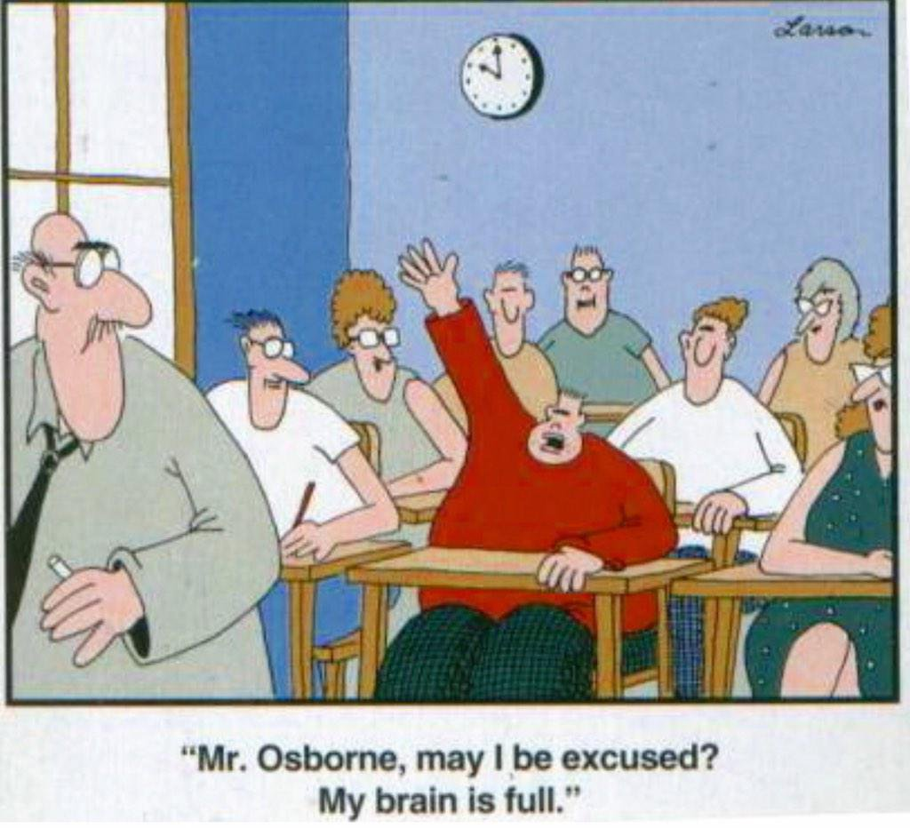

<style type="text/css">
span.boxed {
  border:5px solid gray;
  border-radius:10px;
  padding: 5px;
}
span.invboxed {
  border:5px solid gray;
  padding: 5px;
  border-radius:10px;
  color: white;
}
table, td, th
{
border:0px;
}
</style>


## A note about these slides

The support for documentation creation in RStudio
is great.

 * These slides are HTML, but I created them in RMarkdown (+ a little bit of HTML fiddling)

 * A single RMarkdown file can generate PDF, HTML, or Word
 
   * No need to know HTML, LateX or Word
   
   * But if you do, you can take advantage
   

# Less Volume, More Creativity

## Less Volume, More Creativity

```{r setup,  echo = FALSE, warning = FALSE, message = FALSE}
require(magrittr)
require(lubridate)
require(dplyr)
require(mosaic)
require(ggformula)
trellis.par.set(theme = col.mosaic())
theme_set(theme_bw())
require(knitr)
opts_chunk$set(
  cache = TRUE,
  size = 'small', 
  fig.width = 8, 
  fig.height = 3,
  out.width = 800,
  out.height = 300,
  tidy = FALSE)

options(width = 90)
options(digits = 3)
```


## Mike McCarthy

<table><tr align="top" padding=5><td width="20%" align="top">
</td>
<td align="top"> 
Head coach, Green Bay Packers (NFL Football)

 * Packers subscribe to "draft and develop"
 * Among the youngest teams in the league every year
 * Coaching staff constantly teaching young players
</td>
</tr>
</table>

## Mike McCarthy

<table><tr align="top" cellpadding=5><td width="20%" align="top">
</td>
<td align="top"> 
Head coach, Green Bay Packers (NFL Football)

 * Packers subscribe to "draft and develop"
 * Among the youngest teams in the league every year
 * Coaching staff constantly teaching young players
</td>
</tr>
</table>

**Joe from Fitchburg, WI:**

> Do you have a favorite Mike McCarthy quote? 

## Mike McCarthy

<table><tr align="top" padding=5><td width="20%" align="top">
</td>
<td align="top"> 
Head coach, Green Bay Packers (NFL Football)

 * Packers subscribe to "draft and develop"
 * Among the youngest teams in the league every year
 * Coaching staff constantly teaching young players
</td>
</tr>
</table>


**Joe from Fitchburg, WI:**

> Do you have a favorite Mike McCarthy quote? 
> Mine is "statistics are for losers".

## Mike McCarthy

<table><tr align="top" padding=5><td width="20%" align="top">
</td>
<td align="top"> 
Head coach, Green Bay Packers (NFL Football)

 * Packers subscribe to "draft and develop"
 * Among the youngest teams in the league every year
 * Coaching staff constantly teaching young players
</td>
</tr>
</table>


**Joe from Fitchburg, WI:**

> Do you have a favorite Mike McCarthy quote? 
> Mine is "statistics are for losers".


**Vic Ketchman (packers.com):**

> "Less volume, more creativity."

Source: [Ask Vic @ packers.com](http://www.packers.com/news-and-events/article-ask-vic/article-1/Half-line-drills-best-thing-about-training-camp/a6cca4ae-7e15-4fb5-a32f-4a066340eb18#ixzz3dqBGgs7b)


## More Mike McCarthy Quotes

You’ve got to watch that you **don’t do too much**. We have a philosophy on our coaching staff about **less volume, more creativity**. 
<br><br>

A lot of times you end up putting in a lot more volume, because you are teaching fundamentals  and you are teaching concepts that you need to put in, but you may not necessarily use because they are building blocks for other concepts and variations that will come off of that ... **In the offseason you have a chance to take a step back and tailor it more specifically towards your  team and towards your players.**" 

## More Mike McCarthy Quotes

**Q.** (for McCarthy) How many offensive and defensive plays might you have coming into a game on average?

**A.** That's an excellent question because years ago when I first got into the NFL we had 150 passes in our game plan. I've put a sign on all of the coordinators' doors - **less volume, more creativity**. We function with more concepts with less volume. We're more around 50 (passes) into a game plan.
           
           
Source: [http://www.jsonline.com/packerinsider/106968233.html](http://www.jsonline.com/packerinsider/106968233.html) (Nov 10, 2010)


## The Minimal R Exercise

**List** every R command used throughout a course/project

**Organize** by syntactic similarity and by purpose

**Scratch** everything you could have done without

**Replace** dissimilar tools with more similar tools

**Aim** for a set of commands that is

 * **small**: fewer is better
 * **coherent**:  commands should be as similar as possible
 * **powerful**: can do what needs doing 

**Result:** [Minimal R for Intro Stats ](https://github.com/ProjectMOSAIC/mosaic/blob/master/vignettes/MinimalR.pdf)

## Less Volume, More Creativity 
 
It is not enough to use R, 
it must be used efficiently and elegantly because human brain power 
is the most limited resource most of our projects have.


<center>

</center>

## Less Volume, More Creativity 

### Some propopsed solutions

 * `mosaic` and `ggformula` -- making the most of formulas
 
 * `tidyverse` -- grammar of data transformation
 
 * R Markdown -- document creation for humans who use R
 

<table>
<tr>
<td>
Perfection is achieved, not when there is nothing more to add, but when there is nothing left to take away. 
<br><br>
--- Antoine de Saint-Exupery (writer, poet, pioneering aviator)
</td>
<td width="20%"> 

</tr>
</table>


## Choose Wisely

R's biggest strength is also its biggest weakness:  A large, active user-base that 
provides packages for the community to use.

 * quality varies from pacakge to package
 * style varies even more
 
If you are new to R, you will learn faster and be happier if you can learn a 
few flexible tools very well than if you run with the first thing you google that 
gets today's job done.

## Outline of the day

  * Introduction to `ggformula` (plotting with formulas)
  
  * Data Wrangling in the `tidyverse`
  
  * R Markdown (if time/interest)
  
Be sure to interrupt with questions along the way.


