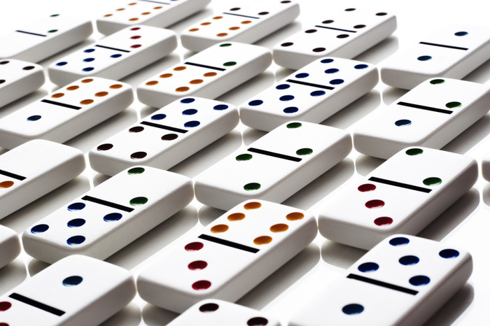
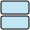
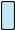
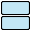
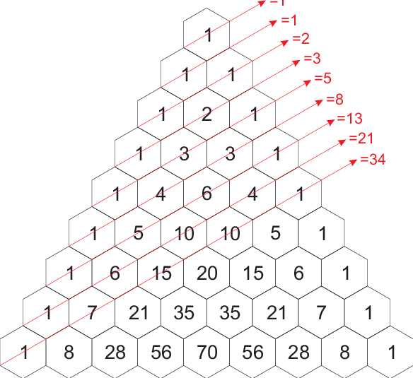
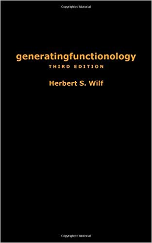

<style>
div.domalgebra{
  font-size: 40px;
}
div.domalgebra td{
  padding: 10px;
}

<!-- </style> -->
<!-- <script type="text/x-mathjax-config"> -->
<!--   MathJax.Hub.Config({ -->
<!--     extensions: ["tex2jax.js"], -->
<!--     jax: ["input/TeX", "output/HTML-CSS"], -->
<!--     tex2jax: { -->
<!--       inlineMath: [ ['$','$'], ["\\(","\\)"] ], -->
<!--       displayMath: [ ['$$','$$'], ["\\[","\\]"] ], -->
<!--       processEscapes: true -->
<!--     }, -->
<!--     "HTML-CSS": {  -->
<!--       fonts: ["Neo-Euler", "Asana-Math", "Gyre-Pagella", "Gyre-Termes", "STIX-Web", "TeX"], -->
<!--     } -->
<!--   }); -->

<!-- </script> -->


```{r setup, include=FALSE}
# TeX, STIX-Web, Asana-Math, Neo-Euler, Gyre-Pagella, Gyre-Termes and Latin-Modern
knitr::opts_chunk$set(
  echo = TRUE,
  comment = NA)
library(mosaic)
library(svglite)
library(printr)
library(stringr)
library(ggformula)
theme_set(theme_bw())
library(r2d3)
```

```{r functions, include = FALSE}
tile_data1 <- function(pattern, id = 1) {
  # split into rows at line breaks
  pattern <- str_split(pattern, "\n")[[1]] %>% rev()
  # remove empty rows
  pattern <- pattern[sapply(pattern, nchar) > 0]
  horiz <- 
    lapply(pattern, function(x) str_locate_all(x, "<")[[1]][, "start"])
  vert <- 
    lapply(pattern, function(x) str_locate_all(x, "V")[[1]][, "start"])
  # pattern
  H <-
    tibble(
      y = rep(1:length(horiz), sapply(horiz, length)),
      x = unlist(horiz),
      width = 2,
      height = 1,
      ymax = y + height,
      xmax = x + width,
      direction = "H",
      id = id
    )
  V <- 
    tibble(
      y = rep(1:length(vert),  sapply(vert, length)),
      x = unlist(vert),
      width = 1,
      height = 2,
      ymax = y + height,
      xmax = x + width,
      direction = "V",
      id = id
    )
  bind_rows(H, V) %>%
    group_by(id) %>%
    mutate(element = 1:n())
}

tile_data <- function(pattern) {
  lapply(
    seq_len(length(pattern)), 
    function(i) tile_data1(pattern[i], i)
  ) %>%
    bind_rows()
}

tile_plot <- function(data, color = "navy", fill = "transparent", ...) {
  data %>%
    gf_rect(y + ymax ~ x + xmax | ~ id, color = color, fill = fill, ...) %>%
    gf_theme(theme_void()) %>%
    gf_refine(coord_equal())
  
}
```

```{d3 dominos3by-d2, include = FALSE}
svg.selectAll('rect')
  .data(data)
  .enter().append('rect')
    .attr('rx', function(d) {return 2;})
    .attr('ry', function(d) {return 2;})
    .attr('x', function(d) {
                 return (d.x - 1) * options.size + 1 + 
                          options.space * (d.id - 1);})
    .attr('y', function(d) {return (d.y - 1) * options.size + 1;})
    .attr('width',  function(d) {return d.width  * options.size - 2;})
    .attr('height', function(d) {return d.height * options.size - 2;})
    .attr('fill', 'skyblue')
    .attr('fill-opacity', 0.5)
    .attr('stroke', 'black')
    .on("mouseover", function(){ d3.select(this).attr('fill', 'orange'); })
    .on("mouseout",  function(){ 
        if (d3.select(this).attr('fill') == 'orange') {
            d3.select(this).attr('fill', 'steelblue'); };})
    .on("click",     function(){ svg.selectAll("rect").attr('fill', 'skyblue') });
    
svg.selectAll('text')
  .data(data)
  .enter().append('text')
    .attr('x', function(d) {return (d.id - 1) * options.space - 17;})
    .attr('y', function(d) {return 20;})
    .attr('opacity', function(d) {return (d.element == 1 & d.id > 1) ? 1 : 0;})
    .text(options.plus)
    .on("click", 
        function(d){ 
          svg.selectAll("rect")
            .attr('fill', function(d) {return d.x == 1 ? 'steelblue' : 'skyblue';}) 
        });
```

```{d3 dominos3by-d3, include = FALSE}

svg.selectAll('rect')
  .data(data)
  .enter().append('rect')
    .attr('rx', function(d) {return 2;})
    .attr('ry', function(d) {return 2;})
    .attr('x', function(d) {
                 return (d.x - 1) * options.size + 1 + 
                          options.space * (d.id - 1);})
    .attr('y', function(d) {return (d.y - 1) * options.size + 1;})
    .attr('width',  function(d) {return d.width  * options.size - 2;})
    .attr('height', function(d) {return d.height * options.size - 2;})
    .attr('fill', 'skyblue')
    .attr('fill-opacity', 0.5)
    .attr('stroke', 'black')
    .on("mouseover", function(){ d3.select(this).attr('fill', 'orange'); })
    .on("mouseout",  function(){ 
        if (d3.select(this).attr('fill') == 'orange') {
            d3.select(this).attr('fill', 'steelblue'); };})
    .on("click",     function(){ svg.selectAll("rect").attr('fill', 'skyblue') });
    
svg.selectAll('text')
  .data(data)
  .enter().append('text')
    .attr('x', function(d) {return (d.id - 1) * options.space - 17;})
    .attr('y', function(d) {return 30;})
    .attr('opacity', function(d) {return (d.element == 1 & d.id > 1) ? 1 : 0;})
    .text(options.plus)
    .on("click", 
        function(d){ 
          svg.selectAll("rect")
            .attr('fill', function(d) {return d.x == 1 ? 'red' : 'skyblue';}) 
        });
```
## What is a Domino?

```{r echo = FALSE, fig.align = "center", out.height = "30%"}

```

## What is a Domino?

For our purposes, a domino is a 2 x 1 rectangle:

```{r, include = FALSE}
TT <-
 list(
  c("
^
V
"),
  c("
^^
VV
",
"
<>
<>
"
) ,
  c("
^^^
VVV
",
"
^<>
V<>
",
"
<>^
<>V
"
) ,
  c("
^^^^
VVVV
",
"
^^<>
VV<>
",
"
^<>^
V<>V
",
"
<>^^
<>VV
",
"
<><>
<><>
"
) 
)
```


```{r U2, include = FALSE}
U2 <- c(
"
^^
VV
<>
",
"
<>
<>
<>
",
"
<>
^^
VV
"
)
```

```{r U4, include = FALSE}
U4 <- c(
"
^^^^
VVVV
<><>
",
"
^^<>
VV<>
<><>
",
"
^^<>
VV^^
<>VV
",
"
<>^^
<>VV
<><>
",
"
<><>
<><>
<><>
",
"
<><>
<>^^
<>VV
",
"
<>^^
^^VV
VV<>
",
"
<><>
^^<>
VV<>
",
"
<><>
^^^^
VVVV
",
"
<><>
^<>^
V<>V
",
"
^<>^
V<>V
<><>
"
)
```


```{d3, ref.label = "dominos3by-d3", data = TT[[1]] %>% tile_data(), options = list(size = 30, space = 80, plus = ","), height = 3 * 30, width = 80, echo = FALSE, container = "svg"}
```

* Numbers on the dominos don't matter
* Arithmetic will be about something else (stay tuned)

## Problem of the day

### Q. How many wanys can we tile a 3 $\times$ n rectangle with 2 $\times$ 1 dominoes?

#### **Rules**

* no overlap
* no gaps

#### **Notation** 

 * u(n) = number of ways to tile a 3 $\times$ n rectangle
 * U(n) = listing of all tilings of a 3 $\times$ n rectangle
 * u(n) = |U(n)|

### **Example:** What is u(2)?  What is U(2)?

## u(2) = 3

Here's U(2):

```{d3, ref.label = "dominos3by-d3", data = U2 %>% tile_data(), options = list(size = 30, space = 80, plus = " "), height = 3 * 30, width = 2 * 3 * 30 + 2 * 20, echo = FALSE, container = "svg"}
```


## u(2) = 3

Here's U(2):

```{d3, ref.label = "dominos3by-d3", data = U2 %>% tile_data(), options = list(size = 30, space = 80, plus = " "), height = 3 * 30, width = 2 * 3 * 30 + 2 * 20, echo = FALSE, container = "svg"}
```

<br>
<br>

### How do we know there aren't any more?

* "I couldn't find any more" is not an acceptable answer.


## Your Turn 

How much of this table can you fill out?

<div class = "columns-2">
 n  | u(n) | U(n)
--- | ---- | ----
 1  |  ?   |   ?
 2  |  ?   |   ?
 3  |  ?   |   ?
 4  |  ?   |   ?
 5  |  ?   |   ?

<br>

 n  | u(n) | U(n)
--- | ---- | ----
 6  |  ?   |   ?
 7  |  ?   |   ?
 8  |  ?   |   ?
 9  |  ?   |   ?
 10 |  ?   |   ?
 </div>

<!-- U(0) | U(1) | U(2) | U(3) | U(4) | U(5) | U(6) | U(7) | U(8)  | ...  -->
<!-- ---- | ---- | ---- | ---- | ---- | ---- | ---- | ---- | ----- |    -->
<!--   ?  |   ?  |   3  |  ?   |  ?   |  ?   |  ?   |   ?  |  ?    | ... -->


## Which values of u(n) are easy?

## Which values of u(n) are easy?

If n is odd, then u(n) = 0.

* Area of 3 $\times$ n rectangle is 3n, which is odd when n is **odd**.
* Area covered by dominos is 2d (d = number of dominos), which is **even**.
* So it isn't possible to tile a 3 $\times$ n rectangle with dominos when n is odd.

## What is u(4)?

## What is u(4)?

### **u(4) = 11**

```{d3, ref.label = "dominos3by-d3", data = U4 %>% tile_data(), options = list(size = 15, space = 80), height = 3 * 15, width = 11 * 80, echo = FALSE, container = "svg"}
```

<br><br>

### **u(6) = ??**

<br><br>

### **u(8) = ??**

## Filling out the table 

u(0) | u(1) | u(2) | u(3) | u(4) | u(5) | u(6) | u(7) | u(8)  | ... 
---- | ---- | ---- | ---- | ---- | ---- | ---- | ---- | ----- |   
  1  |   0  |   3  |  0   |  11  |  0   |  ?   |   0  |  ?    | ...
  
<br><br>

These get hard fast... We need some help.

  
```{r, echo = FALSE, include = FALSE}
tibble(
  n = c(0, 1, 2, 3, 4, 5, 6),
  `u(n)` = c(1, 0, 2, 0, "?", 0, "?")
)
```


## Help!

To solve this problem, we need 

* an easier problem to practice on
* a more systematic approach

## Let's try tiling 2 $\times$ n rectangles

### **Notation** 

 * t(n) = number of ways to tile a 2 $\times$ n rectangle
 * T(n) = listing of all tilings of a 2 $\times$ n rectangle
 * t(n) = |T(n)|

### **Example:** What is t(2)?  What is T(2)?

## t(2) = 2

Here's T(2):

```{d3, ref.label = "dominos3by-d3", data = TT[[2]] %>% tile_data(), options = list(size = 30, space = 80, plus = ","), height = 3 * 30, width = 2 * 2 * 30 + 20, echo = FALSE, container = "svg"}
```

## Your Turn 

How much of this table can you fill in?

<div class = "columns-2">
 n  | t(n) | T(n)
--- | ---- | ----
 1  |  ?   |   ?
 2  |  ?   |   ?
 3  |  ?   |   ?
 4  |  ?   |   ?
 5  |  ?   |   ?

<br>

 n  | t(n) | T(n)
--- | ---- | ----
 6  |  ?   |   ?
 7  |  ?   |   ?
 8  |  ?   |   ?
 9  |  ?   |   ?
 10 |  ?   |   ?
 
 </div>

## T

```{d3 T1, ref.label = "dominos3by-d3", data = TT[[1]] %>% tile_data(), options = list(size = 30, space = 40, plus = ","), height = 3 * 30, width = 1 * 1 * 30, echo = FALSE, container = "svg"}
```

```{d3 T2, ref.label = "dominos3by-d3", data = TT[[2]] %>% tile_data(), options = list(size = 30, space = 80, plus = ","), height = 2 * 2 * 30 + 10, width = 2 * 2 * 30 + 20, echo = FALSE, container = "svg"}
```

```{d3 T3, ref.label = "dominos3by-d3", data = TT[[3]] %>% tile_data(), options = list(size = 30, space = 110, plus = ","), height = 3 * 30, width = 3 * 3 * 30 + 2 * 20, echo = FALSE, container = "svg"}
```

```{d3 T4, ref.label = "dominos3by-d3", data = TT[[4]] %>% tile_data(), options = list(size = 30, space = 4 * 30 + 20, plus = ","), height = 3 * 30, width = 5 * 4 * 30 + 4 * 20, echo = FALSE, container = "svg"}
```

## A table for t

<div class = "columns-2">
 n  | t(n) 
--- | ---- 
 1  |  1   
 2  |  2   
 3  |  3   
 4  |  5   
 5  |  8   
 
<br>

 n  | t(n) 
--- | ---- 
 6  |  13
 7  |  21
 8  |  34
 9  |  55
 10 |  89

 </div>


## What is Arithmetic?

## What is Arithmetic?

[Wikipedia](https://en.wikipedia.org/wiki/Arithmetic) says:

> Arithmetic 
is a branch of mathematics that consists of the study of
*numbers*, especially the properties of the *traditional* **operations** on
them -- **addition**, **subtraction**, **multiplication** and **division**.

<!-- (from the Greek ἀριθμός arithmos, "number" and τική [τέχνη], tiké [téchne], "art")  -->

The primary operations are addition and multiplication.

<!-- ## What is Domino Arithmetic? -->


<!-- > **Domino** arithmetic (from the Greek ἀριθμός arithmos, "number" and τική [τέχνη], tiké -->
<!-- [téchne], "art") is a branch of mathematics that consists of the study of -->
<!-- ~~*numbers*~~ dominoes, especially the properties of the ~~*traditional*~~  -->
<!-- **operations** on them --  -->
<!-- **addition**, **subtraction**, **multiplication** and **division**. -->

## What is Domino Arithmetic?

> **Domino** arithmetic is a branch of mathematics that consists of the study of
~~*numbers*~~ **domino tilings**, 
especially the properties of the ~~*traditional*~~ **operations** on them -- 
**addition**, **subtraction**, **multiplication** and **division**.

### We need some operations on tilings

If A and B are tilings, what are

* A + B?
* A $\cdot$ B = A * B = AB?

(Note: there is a little white lie on this slide that we will fix in a moment.)

## Domino Algebra

We would like domino algebra to be

* useful
* somewhat familiar

Can you come up with definitions of addition and multiplication so that

### (A+B) (C+D) = AC + AD + BC + BD

Examples:

<div class = "domalgebra">
(  + 
   )
(  + 
  ) = ??
</div>

<div class = "domalgebra">
(  + 
   )
(  + 
  ) = ??
</div>

## Domino Algebra


Can you come up with definitions of addition and multiplication so that

### (A+B) (C+D) = AC + AD + BC + BD

Examples:

<div class = "domalgebra">
<table>
<tr>
<td>
(  + 
   )
(  + 
  )
</td>
<td> = </td>
<td>
  
+ 
+ 
+   
</td>
</tr>
<tr>
<td>
( + 
   )
( + 
  )
</td>
<td>=</td>
<td>
   
+ 
+ 
+ 
</td>
</tr>
<tr>
<td></td>
<td>=</td>
<td>
   
+ 2 
+ 
</td>
</tr>
</table>
</div>


Note:

* multiplication does not commute!
* additional does commute if we are not interested in the order of our list.

## Equations for T(n)

```{d3 T1, ref.label = "dominos3by-d3", data = TT[[1]] %>% tile_data(), options = list(size = 30, space = 40, plus = "+"), height = 3 * 30, width = 1 * 1 * 30, echo = FALSE, container = "svg"}
```

```{d3 T2, ref.label = "dominos3by-d3", data = TT[[2]] %>% tile_data(), options = list(size = 30, space = 80, plus = "+"), height = 2 * 2 * 30 + 10, width = 2 * 2 * 30 + 20, echo = FALSE, container = "svg"}
```

```{d3 T3, ref.label = "dominos3by-d3", data = TT[[3]] %>% tile_data(), options = list(size = 30, space = 110, plus = "+"), height = 3 * 30, width = 3 * 3 * 30 + 2 * 20, echo = FALSE, container = "svg"}
```

```{d3 T4, ref.label = "dominos3by-d3", data = TT[[4]] %>% tile_data(), options = list(size = 30, space = 4 * 30 + 20, plus = "+"), height = 3 * 30, width = 5 * 4 * 30 + 4 * 20, echo = FALSE, container = "svg"}
```


T(n) =  T(n-1)
     +  T(n-2) 
     
So t(n) = t(n-1) + t(n-2)  [Fibonacci]


## T Time

Let T be the list of **all** tilings of rectangles with 2 rows (and any
number of columns).

<center>
T = T(0) + T(1) + T(2) + $\cdots$
</center>

<br>

Wait, what is T(0)? Tilings of a 2 $\times$ 0 rectangle?

* How many are there? (What is t(0)?)
* How should we denote this?

## The Fundamental Equation for T

<div class = "domalgebra">
T = 1 + <svg width="15" height="30" style="background: rgb(255, 255, 255); fill: rgb(0, 0, 0); color: rgb(0, 0, 0);">
<rect rx="2" ry="2" x="1" y="1" width="13" height="28" fill="skyblue" fill-opacity="0.5" stroke="black">
</rect>
</svg> T
+
<svg width="30" height="30" style="background: rgb(255, 255, 255); fill: rgb(0, 0, 0); color: rgb(0, 0, 0);">
<rect rx="2" ry="2" x="1" y="1" width="28" height="13" fill="skyblue" fill-opacity="0.5" stroke="black">
</rect>
<rect rx="2" ry="2" x="1" y="16" width="28" height="13" fill="skyblue" fill-opacity="0.5" stroke="black">
</rect> 
</svg> T
</div>

### Can you Solve for T?

## Fundamental Equation

<div class = "domalgebra">
T = 1 + <svg width="15" height="30" style="background: rgb(255, 255, 255); fill: rgb(0, 0, 0); color: rgb(0, 0, 0);">
<rect rx="2" ry="2" x="1" y="1" width="13" height="28" fill="skyblue" fill-opacity="0.5" stroke="black">
</rect>
</svg> T
+
<svg width="30" height="30" style="background: rgb(255, 255, 255); fill: rgb(0, 0, 0); color: rgb(0, 0, 0);">
<rect rx="2" ry="2" x="1" y="1" width="28" height="13" fill="skyblue" fill-opacity="0.5" stroke="black">
</rect>
<rect rx="2" ry="2" x="1" y="16" width="28" height="13" fill="skyblue" fill-opacity="0.5" stroke="black">
</rect> 
</svg> T
</div>

### Solving for T

<div class = "domalgebra">
1 = T - <svg width="15" height="30" style="background: rgb(255, 255, 255); fill: rgb(0, 0, 0); color: rgb(0, 0, 0);">
<rect rx="2" ry="2" x="1" y="1" width="13" height="28" fill="skyblue" fill-opacity="0.5" stroke="black">
</rect>
</svg> T
-
<svg width="30" height="30" style="background: rgb(255, 255, 255); fill: rgb(0, 0, 0); color: rgb(0, 0, 0);">
<rect rx="2" ry="2" x="1" y="1" width="28" height="13" fill="skyblue" fill-opacity="0.5" stroke="black">
</rect>
<rect rx="2" ry="2" x="1" y="16" width="28" height="13" fill="skyblue" fill-opacity="0.5" stroke="black">
</rect> 
</svg> T
</div>

<div class = "domalgebra">
1 = (1 
- <svg width="15" height="30" style="background: rgb(255, 255, 255); fill: rgb(0, 0, 0); color: rgb(0, 0, 0);">
<rect rx="2" ry="2" x="1" y="1" width="13" height="28" fill="skyblue" fill-opacity="0.5" stroke="black">
</rect>
</svg> 
- <svg width="30" height="30" style="background: rgb(255, 255, 255); fill: rgb(0, 0, 0); color: rgb(0, 0, 0);">
<rect rx="2" ry="2" x="1" y="1" width="28" height="13" fill="skyblue" fill-opacity="0.5" stroke="black">
</rect>
<rect rx="2" ry="2" x="1" y="16" width="28" height="13" fill="skyblue" fill-opacity="0.5" stroke="black">
</rect> 
</svg>) T
</div>

<div class = "domalgebra">
T = 1 / (1 - <svg width="15" height="30" style="background: rgb(255, 255, 255); fill: rgb(0, 0, 0); color: rgb(0, 0, 0);">
<rect rx="2" ry="2" x="1" y="1" width="13" height="28" fill="skyblue" fill-opacity="0.5" stroke="black">
</rect>
</svg> 
-
<svg width="30" height="30" style="background: rgb(255, 255, 255); fill: rgb(0, 0, 0); color: rgb(0, 0, 0);">
<rect rx="2" ry="2" x="1" y="1" width="28" height="13" fill="skyblue" fill-opacity="0.5" stroke="black">
</rect>
<rect rx="2" ry="2" x="1" y="16" width="28" height="13" fill="skyblue" fill-opacity="0.5" stroke="black">
</rect> 
</svg>)
</div>

Technically, we need a left multiplicative inverse, but let's stick
with this notation.

## Do you Recognize This?

<div class = "domalgebra">

<table>
<tr>
<td>
T = 
</td>
<td>
<table>
<tr style="border-bottom: 3px solid #666666">
<td align = "center"> 1 </td>
</tr>
<tr>
<td>1 -  - 
</td>
</tr>
</table>
<td>
= 
</td>
<td>
<table>
<tr style="border-bottom: 3px solid #666666">
<td align = "center"> 1 </td>
</tr>
<tr>
<td>1 - (
+
)
</td>
</tr>
</table>
</td>
</tr>
</table>
</div>

## Geometric Series!

<div class = "domalgebra">

<table>
<tr>
<td>
T = 
</td>
<td>
<table>
<tr style="border-bottom: 3px solid #666666">
<td align = "center"> 1 </td>
</tr>
<tr>
<td>1 - ( + )
</td>
</tr>
</table>
</td>
<td> = 
1 + 
( + )
+
( + )<sup>2</sup>
+
( + )<sup>3</sup>
+ $\cdots$
</td>
</tr>
</table>
</div>

<div class = "domalgebra">
&nbsp;
&nbsp;
= 1 + 
 + 
+ 
+ 
+ 
+ 
+ 
+ 
+ $\cdots$
</div>


## Using letters


<div class = "domalgebra">
If we let 
x = 
and y<sup>2</sup> =  (and let
$x$ and $y$ commute), then
</div>


$$
\begin{align}
T &= \frac{1}{1 - (x + y^2)} = \sum_{k=0}^\infty (x + y^2)^k
\\
& = 
\sum_{k,j \ge 0} \binom{k}{j} x^j y^{2(k-j)}
\\
& = 
\sum_{m,j \ge 0} \binom{m+j}{j} x^j y^{2m}  \tag{$m = k-j$}
\end{align}
$$

So the number of tilings with $j$  and 
$m$  is $\binom{m+j}{j}$.

## This gives us another way to compute t(n)

Example: 

$$
\small
\begin{align*}
t(8) &= \binom{0+4}{0} 
+ \binom{2 + 3}{2}
+ \binom{4 + 2}{4}
+ \binom{6 + 1}{6}
+ \binom{8 + 0}{8}
\\
&=
`r choose(4,0)` +
`r choose(5,2)` +
`r choose(6,4)` +
`r choose(7,6)` +
`r choose(8,8)` 
\\
&= 
`r choose(4,0) + choose(5,2) + choose(6,4) + choose(7,6) + choose(8,8)` 
\end{align*}
$$

```{r echo = FALSE, out.width = "30%", fig.align = "center"}

```

## One more slight of hand

Now let $x = y = z$ 
(a domino is a domino is a domino -- ignore orientation).

$$
\begin{align}
T &= 1 + zT + z^2 T
\end{align}
$$
So

$$
\begin{align}
T &= \frac{1}{1 - z - z^2}\\
\end{align}
$$

<!-- (Unfortunately, this is not a geometric series, so we have some work to do.) -->

## Geometric Series to the Rescue

We would like to write 
$$
\begin{align}
T &= \frac{1}{1 - z - z^2}
= \sum_{n=0}^\infty t_n z^n
\\
\end{align}
$$
as 

$$
\begin{align}
T &= \frac{1}{1 - z - z^2}
  = \frac{A}{1 - \alpha z} + \frac{B}{1-\beta z}\\[5mm]
  & = A[1 + \alpha z + \alpha^2 z^2 + \cdots] + B[1 + \beta z + \beta^2 z^2 + \cdots]\\\\
\end{align}
$$
So $t_n = A \alpha^n + B \beta^n$. \ \  
We just need to determine $\alpha$, $\beta$, $A$, and $B$.

## Finding $\alpha$, $\beta$, $A$, and $B$

$$
\begin{align}
T &= \frac{1}{1 - z - z^2}
  = \frac{A}{1 - \alpha z} + \frac{B}{1-\beta z}
  = \frac{A(1-\beta z) + B(1-\alpha z)}{(1-\alpha z)(1 - \beta z)}
  \\[5mm]
\end{align}
$$

## Finding $\alpha$, $\beta$, $A$, and $B$

$$
\begin{align}
T &= \frac{1}{1 - z - z^2}
  = \frac{A}{1 - \alpha z} + \frac{B}{1-\beta z}
  = \frac{A(1-\beta z) + B(1-\alpha z)}{(1-\alpha z)(1 - \beta z)}
  \\[5mm]
\end{align}
$$

Denominator:

$$
\begin{align}
1 - z - z^2 & = 1 - (\alpha + \beta)z + \alpha\beta z^2 \\
1 &= \alpha + \beta\\
-1 & = \alpha \beta
\end{align}
$$

## Finding $\alpha$, $\beta$, $A$, and $B$

$$
\begin{align}
T &= \frac{1}{1 - z - z^2}
  = \frac{A}{1 - \alpha z} + \frac{B}{1-\beta z}
  = \frac{A(1-\beta z) + B(1-\alpha z)}{(1-\alpha z)(1 - \beta z)}
  \\[5mm]
\end{align}
$$

Denominator:

$$
\begin{align}
1 - z - z^2 & = 1 - (\alpha + \beta)z + \alpha\beta z^2 \\
1 &= \alpha + \beta\\
-1 & = \alpha \beta
\end{align}
$$

Numerator:
$$
\begin{align}
1 &=  A (1 -\beta z) + B (1-\alpha z) =  (A + B) - (A \beta + B \alpha) z \\
1 &=  A+B \\
0 &= A\beta + B \alpha
\end{align}
$$


## Four equations, four unknowns

$$
\begin{align}
\alpha + \beta & = 1 &  \alpha \beta &= -1 \\
A + B &= 1 & A\beta + B \alpha &= 0
\end{align}
$$

## Finding $\alpha$, $\beta$

$$
\begin{align}
\alpha + \beta & = 1 &  \alpha \beta &= -1 \\
\end{align}
$$
From this we get

$$
\begin{align}
-1 &= \alpha \beta = \alpha (1-\alpha) = \alpha - \alpha^2 &
0 & = \alpha^2 - \alpha - 1\\
\alpha &= \frac{1 + \sqrt{5}}{2} \approx 1.618 & 
\beta  &= \frac{1 - \sqrt{5}}{2} \approx -0.618\\
\end{align}
$$

Recall that $t_n = A\alpha^n + B \beta^n$.

Since $|\beta| < 1$, $|\beta|^n \searrow 0$ as $n \to \infty$, so we can basically
ignore that part: 

$$
\fbox{$t_n \approx A \alpha^n$} 
$$

## Finding $A$ (and $B$)

$$
\begin{align}
\alpha + \beta & = 1 &  \alpha \beta &= -1 \\
A + B &= 1 & A\beta + B \alpha &= 0 \\[12mm]
\end{align}
$$

&nbsp;

$$
\begin{align}
0 &= A \beta + (1-A) \alpha  \\
0 &= A \beta + \alpha - A \alpha \\
0 &= A (\beta -\alpha) + \alpha \\[5mm]
A &= \frac{\alpha}{\alpha - \beta} =  \frac{\alpha}{\sqrt{5}}\\
B &= 1 - A = \frac{\alpha - \beta}{\alpha - \beta} - \frac{\alpha}{\alpha - \beta} =  \frac{-\beta}{\sqrt{5}}
\end{align}
$$

## Putting it all together

$$
\begin{align}
t_n &= A \alpha^n + B \beta^n = \frac{\alpha^{n+1}}{\sqrt{5}} - \frac{\beta^{n+1}}{\sqrt{5}} \\[5mm]
 t_n   &\approx A \alpha^n = \frac{\alpha^{n+1}}{\sqrt{5}}
 \\[12mm]
\end{align}
$$
where

$$
\begin{align*}
\alpha &= \frac{1 + \sqrt{5}}{2} \approx 1.618 & 
\beta  &= \frac{1 - \sqrt{5}}{2} \approx -0.618\\
\end{align*}
$$


## Computation

```{r}
t <- function(n) {
  alpha <- (1 + sqrt(5))/2
  beta  <- (1 - sqrt(5))/2
  A <-   alpha / sqrt(5)
  B <- - beta  / sqrt(5)
  A * alpha^n + B * beta^n
}  

t(0:20)
```

## Table of Values {.smaller}

```{r, echo = FALSE}
T <- function(n) {
  alpha <- (1 + sqrt(5))/2
  beta  <- (1 - sqrt(5))/2
  A <-   alpha / sqrt(5)
  B <- - beta  / sqrt(5)
  tibble(
    n = n,
    t = A * alpha^n + B * beta^n,
    `A part` = format(A * alpha^n, scientific = FALSE),
    `B part` = format(B * beta^n, scientific = FALSE) 
  )
}

T(0:10) %>% knitr::kable()
```


# Tiling 3 x n 

## Fundamental Equation for U

```{d3, ref.label = "dominos3by-d3", data = U4 %>% tile_data(), options = list(size = 15, space = 80, plus = "+"), height = 3 * 15, width = 11 * 80, echo = FALSE, container = "svg"}
```

<br>

<div class = "domalgebra">
U = ??
</div>

## Fundamental Equation for U

```{d3, ref.label = "dominos3by-d3", data = U4 %>% tile_data(), options = list(size = 15, space = 80, plus = "+"), height = 3 * 15, width = 11 * 80, echo = FALSE, container = "svg"}
```

<br>

<div class = "domalgebra">
U = 1 
+ U
+ V
+ &Lambda;
</div>


## Fundamental Equations for U

```{d3, ref.label = "dominos3by-d3", data = U4 %>% tile_data(), options = list(size = 15, space = 80, plus = "+"), height = 3 * 15, width = 11 * 80, echo = FALSE, container = "svg"}
```

<br>

<div class = "domalgebra">
U = 1 
+ U
+ V
+ &Lambda;
</div>

<br>

<div class = "domalgebra">
V =  + U + V 
</div>

<br>

<div class = "domalgebra">
&Lambda; = + U + &Lambda;
</div>


## Algebra

We start with 3 equations and 3 unknowns, $U$, $V$, and $\Lambda$.

$$
\begin{align}
U &= 1 + z^3 U + z^2 V + z^2 \Lambda \\
V &= z U + z^3 V \\ 
\Lambda &= z U + z^3 \Lambda \\ 
\end{align}
$$

We can use these to express $V$ and $\Lambda$ in terms of $U$.
$$
\begin{align}
V &= (1 - z^3)^{-1} z U\\ 
\Lambda &= (1 - z^3)^{-1} z U\\ 
\end{align}
$$

Plugging these in, we now have just one equation with one unknown.

$$
\begin{align}
U &= 1 + z^3 U + z^2 (1 - z^3)^{-1} z U + z^2 (1 - z^3)^{-1} z U 
\end{align}
$$

## Solving for $U$

$$
\begin{align}
U &= 1 + z^3 U + z^2 (1 - z^3)^{-1} z U + z^2 (1 - z^3)^{-1} z U 
\end{align}
$$

$$
\begin{align}
1 &= U - z^3 U - z^2 (1 - z^3)^{-1} z U - z^2 (1 - z^3)^{-1} z U \\
1 &= \left[1 - z^3 - z^2 (1 - z^3)^{-1} z - z^2 (1 - z^3)^{-1} z\right] U \\
U &= \frac{1}{\left[(1 - z^3) - z^2 (1 - z^3)^{-1} z - z^2 (1 - z^3)^{-1} z\right]} \\
U &= \frac{1 - z^3}{\left[(1 - z^3)^2 - 2z^3\right]} \\
\end{align}
$$

## Let $w = z^3$ (dominoes come in threes)

$$
\begin{align}
U &= \frac{1 - z^3}{\left[(1 - z^3)^2 - 2z^3\right]} = 
 \frac{1 - w}{\left[(1 - w)^2 - 2w\right]} \\
  &= \frac{1 - w}{\left[1 -2w + w^2 - 2w\right]} \\
  &= \frac{1 - w}{\left[1 - 4w + w^2 \right]} \\
  & = \frac{A}{1 - \alpha w} + \frac{B}{1-\beta w}\\
  & = A[1 + \alpha w + \alpha^2 w^2 + \cdots] + B[1 + \beta w + \beta^2 w^2 + \cdots]\\\
  &= \sum A \alpha^n w^n + B \beta^n w^n
\end{align}
$$

## Same story as before (but different constants)

$$
\begin{align}
u_n &= A \alpha^n + B \beta^n \\
& = \mbox{number of ways to tile $3 \times 2n$ with $3n$ dominoes}
\end{align}
$$

We just need to determine $\alpha$, $\beta$, $A$, and $B$.

Using algebra similar to the $2 \times n$ case, we get

<!-- $$ -->
<!-- \begin{align} -->
<!-- \alpha + \beta = 4 \\ -->
<!-- \alpha \beta = 1 \\ -->
<!-- A + B = 1  -->
<!-- \end{align} -->
<!-- $$ -->
<!-- From this we get -->
$$
\begin{align}
\alpha &= 2 + \sqrt{3} &
\beta &= 2 - \sqrt{3} \\
A &= \frac{1}{2} + \frac{\sqrt{3}}{6} &
B &= \frac{1}{2} - \frac{\sqrt{3}}{6}\\
\end{align}
$$


## Computation

```{r}
u <- function(n) {
  alpha <- 2 + sqrt(3)
  beta  <- 2 - sqrt(3)
  A <-   1/2 + sqrt(3) / 6
  B <-   1/2 - sqrt(3) / 6
  A * alpha^n + B * beta^n
}
u(0:20)
```


## Table of Values {.smaller} 

```{r, echo = FALSE}
U <- function(n) {
  alpha <- 2 + sqrt(3)
  beta  <- 2 - sqrt(3)
  A <-   1/2 + sqrt(3) / 6
  B <-   1/2 - sqrt(3) / 6
  
  tibble(
    n = 0:20,
    t = t(n), 
    u = u(n),
    `A part` = format(A * alpha^n, scientific = FALSE),
    `B part` = format(B * beta^n, scientific = FALSE) 
  )
}
U(0:10) %>% knitr::kable()
```

<style>
.forceBreak { -webkit-column-break-after: always; break-after: column; }
</style>

## Want to Know More? 


<div style="float: left; width: 50%;">
```{r echo = FALSE, fig.align = "center", fig.height = 10}

```
</div>

<div style="float: right; width: 50%;">
```{r echo = FALSE, fig.align = "center", fig.height = 3}
library(qrcode)
qrcode::qrcode_gen("https://www2.math.upenn.edu/~wilf/gfologyLinked2.pdf")
```
</div>


<div style="text-align: center">
https://www2.math.upenn.edu/~wilf/gfologyLinked2.pdf 
</div>


<!-- ## Some Images -->

<!-- <div class = "domalgebra"> -->
<!-- 1 + <svg width="15" height="30" style="background: rgb(255, 255, 255); fill: rgb(0, 0, 0); color: rgb(0, 0, 0);"> -->
<!-- <rect rx="2" ry="2" x="1" y="1" width="13" height="28" fill="skyblue" fill-opacity="0.5" stroke="black"> -->
<!-- </rect> -->
<!-- </svg> T -->
<!-- + -->
<!-- <svg width="30" height="30" style="background: rgb(255, 255, 255); fill: rgb(0, 0, 0); color: rgb(0, 0, 0);"> -->
<!-- <rect rx="2" ry="2" x="1" y="1" width="28" height="13" fill="skyblue" fill-opacity="0.5" stroke="black"> -->
<!-- </rect> -->
<!-- <rect rx="2" ry="2" x="1" y="16" width="28" height="13" fill="skyblue" fill-opacity="0.5" stroke="black"> -->
<!-- </rect> T -->
<!-- </svg> -->
<!-- </div> -->


<!-- <div class = "domalgebra"> -->
<!-- T = 1 / (1 - <svg width="15" height="30" style="background: rgb(255, 255, 255); fill: rgb(0, 0, 0); color: rgb(0, 0, 0);"> -->
<!-- <rect rx="2" ry="2" x="1" y="1" width="13" height="28" fill="skyblue" fill-opacity="0.5" stroke="black"> -->
<!-- </rect> -->
<!-- </svg>  -->
<!-- - -->
<!-- <svg width="30" height="30" style="background: rgb(255, 255, 255); fill: rgb(0, 0, 0); color: rgb(0, 0, 0);"> -->
<!-- <rect rx="2" ry="2" x="1" y="1" width="28" height="13" fill="skyblue" fill-opacity="0.5" stroke="black"> -->
<!-- </rect> -->
<!-- <rect rx="2" ry="2" x="1" y="16" width="28" height="13" fill="skyblue" fill-opacity="0.5" stroke="black"> -->
<!-- </rect>) -->
<!-- </svg> -->
<!-- </div> -->


<!-- ```{d3, ref.label = "dominos3by-d3", data = TT[[1]] %>% tile_data(), options = list(size = 15, space = 20, plus = "+"), height = 2 * 15, width = 80, echo = FALSE, container = "svg"} -->
<!-- ``` -->

<!-- <br> -->

<!-- ```{d3, ref.label = "dominos3by-d3", data = TT[[2]] %>% tile_data(), options = list(size = 15, space = 50, plus = "+"), height = 2 * 15, width = 80, echo = FALSE, container = "svg"} -->
<!-- ``` -->

<!-- <br> -->

<!-- ```{d3, ref.label = "dominos3by-d3", data = U4[11] %>% tile_data(), options = list(size = 15, space = 50, plus = "+"), height = 3 * 15, width = 80, echo = FALSE, container = "svg"} -->
<!-- ``` -->

<!-- <br> -->

<!-- ```{d3, ref.label = "dominos3by-d3", data = U4[10] %>% tile_data(), options = list(size = 10, space = 50, plus = "+"), height = 3 * 10, width = 80, echo = FALSE, container = "svg"} -->
<!-- ``` -->
<!-- <br> -->

<!-- ```{d3, ref.label = "dominos3by-d3", data = U4[5] %>% tile_data(), options = list(size = 10, space = 50, plus = "+"), height = 3 * 10, width = 80, echo = FALSE, container = "svg"} -->
<!-- ``` -->