## Outline

{.fragment}

## Let's Talk (Data Science) Ethics {visibility="hidden"}

:::{.incremental}
* I'll focus on Data Science

    * *DS $\neq$ AI*

* Your mileage may vary
:::

## Discipline Matters

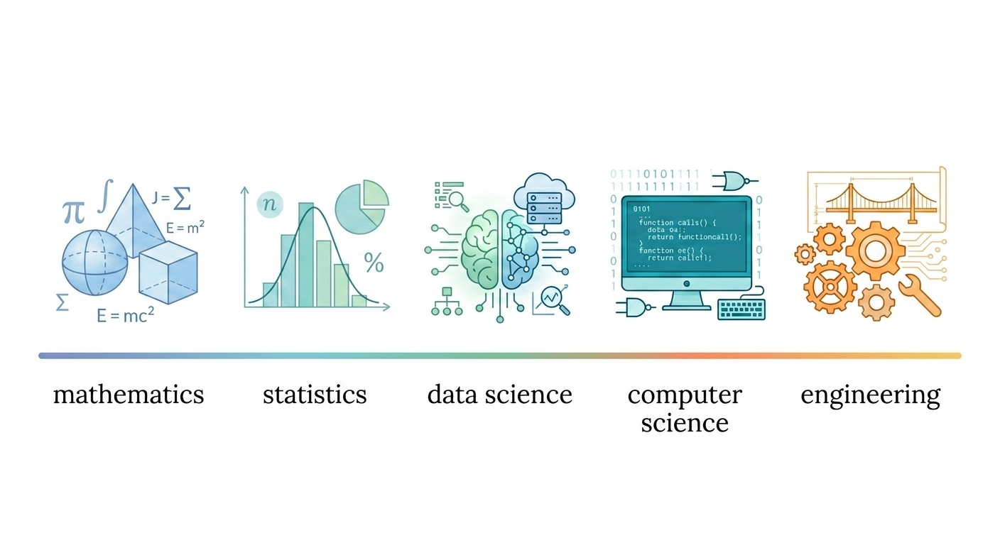

{width=35%}


## Imposter Syndrome

#### ~~Reasons~~ Excuses for not doing this (more)

:::{.incremental}
* I haven't read enough.
* This isn't what I was trained to do.
* I don't know how to find/create materials (not in text book).
* The last thing I tried flopped.
* I don't have time to add this to my course.
* I don't know how to assess this.
* Someone else could do this better.
:::

## How I get by 

&nbsp;

:::{.r-stack}
:::{.fragment .fade-out fragment-index=2}
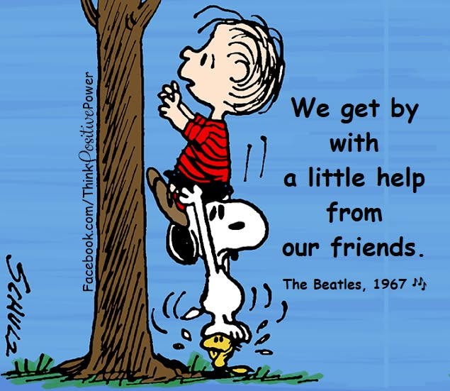
:::

:::{.fragment .fade-in fragment-index=2}
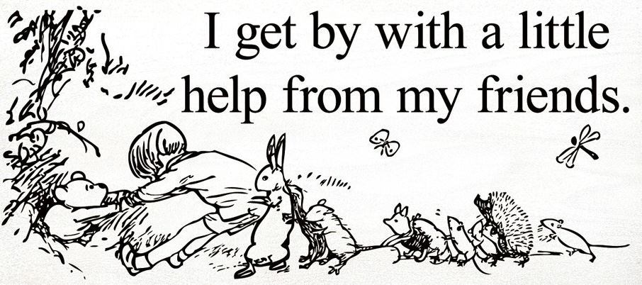

[Source: <https://sawdustcityllc.com/i-get-by-with-a-little-help-from-my-friends-1/>]{style="font-size: 60%"}
:::
:::

## Two of the friends

:::{.columns}
:::{.column width=44%}
{height=350 align=left}
:::
:::{.column width=44%}
{height=350 align=left}
:::
:::

@Carter:2019

:::{#refs}
:::


## integratedethicslabs.org {.scrollable}

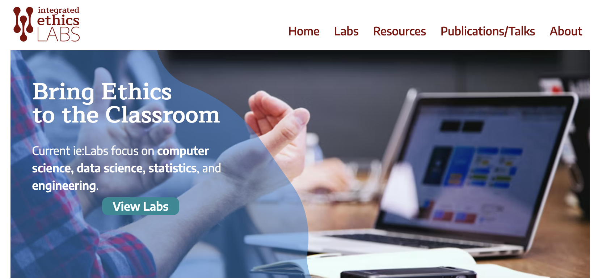

## [Values and Virtues](https://integratedethicslabs.org/labs/core-values/core-values-worksheet/)


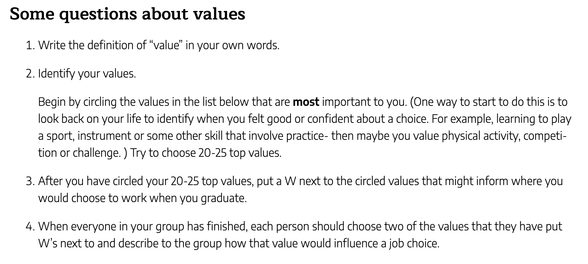

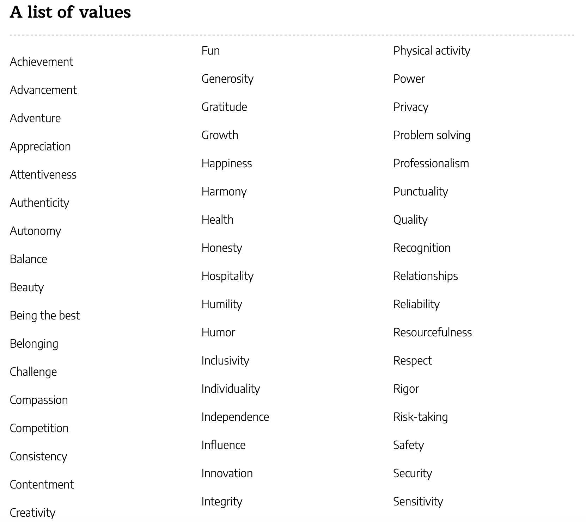

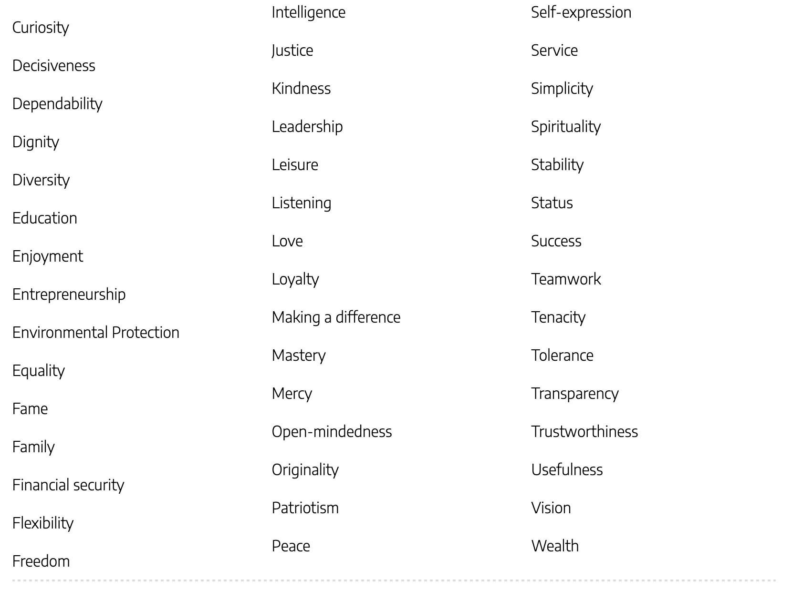{style="position: relative;
  top: -50px;"}

## Two Invitations

:::{.incremental}
1.  **Explore** [integratedethicslabs.org](https://integratedethicslabs.org) 
and give some things a try.

    * Bonus: provide us some feedback.

2.  **Contribute** to [integratedethicslabs.org](https://integratedethicslabs.org).

    * Contact us about submitting something that has worked
    for you and your students.
:::

## Adopt a Philosopher

:::{.columns .fragment}
:::{.column width=50%}
{height=400}
:::
:::{.column width=50%}
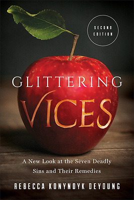{height=400}
:::
:::

## Ethics $\neq$ Solving Dilemmas

:::{.incremental}
* Ethics also about ***default assumptions*** and 
***daily patterns***.
* Individual decisions, 
but also about ***communities*** and ***commitments***.
* ***Context*** matters.
    * This includes personal ***developmental context***.
:::

## Ethics Frameworks

&nbsp; &nbsp; &nbsp; &nbsp; &nbsp;
&nbsp; &nbsp; &nbsp; &nbsp; &nbsp;
{width=17%} &nbsp; &nbsp; &nbsp;
{width=11%} &nbsp;
{width=11%}

. . .

&nbsp;
&nbsp;
&nbsp;
&nbsp;
&nbsp;
&nbsp;
&nbsp;
{height=250}
&nbsp;
&nbsp;
{height=250}
&nbsp;
&nbsp;
{height=250}

[Super heroes idea borrowed from [Fernando Santos](https://www.linkedin.com/in/fernando-pasquini-santos-28846124/)]{style="font-size: 70%"}

## Reflecting on the frameworks


:::{.columns}
:::{.column width=30%}
{width=80%} &nbsp; &nbsp; &nbsp;

:::
:::{.column width=20%}
<br>
{width=90%} &nbsp;

:::
:::{.column width=20%}
<br>

{width=80%}
:::
:::

:::{.columns}
:::{.column width=30%}
Christ-like virtues
:::
:::{.column width=20%}
\+ obedience 
:::
:::{.column width=30%}
&nbsp; \+ shalom
:::
:::

## Morning Routine

Reflect on your morning routine.

:::{.incremental style="font-size:90%"}

a.  **What** things do you always/usually do in the 
    first hour of a typical day for you? (You might also reflect on 
    things you could do, but rarely or never do.)

b.  Reflect on ***why*** those things are part of you morning routine.

    What **values** are implicit in your morning routine?

c.  How might your morning routine decisions be **shaping you**.

    How are you different now from what you might have been with a different
    routine?  
    
    How might you be different in the future if 
    you continue with this morning routine?
:::

## Make Industry Connections


## Make Industry Connections

](https://photos.smugmug.com/photos/i-msstCNQ/0/MtLjprx3p4NTCgFmbN549Rb7Lfj9L8HQt6DFDRKns/XL/i-msstCNQ-XL.jpg)


## Some Jim Vandermey quotes 

:::{.incremental}
* **Make implicit ethical choices explicit.**

* AI is smart but it's not wise.
<!-- * Creepy: Treating people based on data you have, but
they don't know you have. -->
<!-- * Most significant problems in society are not single variable problems. -->
<!-- * Futures are unseen and potential and delivered through
stories and imagination -->

* **Fit tech into people systems**; don't fit people into tech systems.

* **Sometimes need to walk away** from things as a way to 
say something isn't right.
:::

:::{.notes}
* sometimes Jim has gotten asked to come back and help "fix things" after walking away at an earlier stage.
:::

## More Jim Vandermey quotes

:::{.incremental}
* Creating a place where people can thrive is a way of loving your neighbor.

* Specialized, homogeneous teams tend to make bigger mistakes, faster.

* Specialists miss unintended consequences more than generalists.
<!-- * Don't find your meaning in your work. -->
<!-- * Humility is an extremely strong posture
    * You are probably prouder than you think you are
    * CS Lewis quote on humility (step 1: acknowledge conceit)
    * If you subordinate Truth to you will, that is an act of pride and deceit. -->

* **Our businesses are not Christian monocultures.**
:::

## Jim Vandermey examples

<!-- * Login system that could be used as surveillance system. -->

:::{.incremental}
* Nursing home system designed to improve "efficiency", but...

    <!-- * Have you talked to the people who will be using this? -->
    * "Care occurs in the cracks between efficiency."
    * "The cost is being borne by the staff, but the entire benefit is for management."
    * "I feel like you are making this more about the time 
    I spend, than the care I give.
    **I am not a data collection tool**."
    <!-- * Conversation led to major system redesign -->

* Plan to replace call center with chatbots (80%) 
  and have senior people answer the 20%, but...

    * Where will future 20% come if you no longer have
    the 80%?
:::

## Jim Vandermey's action steps

1. Map the unseen.

2. Curate a *Catalog of Cautionary Tales*.

3. Run ethical pre-mortems.

4. Diversify the table.

5. Cultivate organizational memory and wisdom.

6. Prioritize human feedback.

7. Host systems thinking workshops on organizational consequences.

8. Develop your business acumen.

:::{.notes}
On human feedback
    * Jim asked his interns to give feedback on him as a leader.
On business acumen
    * speak in the language of business
    * read latest shareholder report to see what company values
    * talk to different sorts of people each on their terms

:::


<!-- * need to love and extend grace to everyone -->


## Neil Postman


:::{style="font-size: 80%"}
* @Postman:1998
* @Postman:1995:interview
* [1993 Talk at Apple](https://youtu.be/Yi-JOociomI?si=0qM8JteVjayw50_Z&t=337)

:::

## Neil Postman's *Five Things*

#### *we need to know about techologocial change*

:::{.incremental}
1. Culture always pays a price for technology.

2. The advantages and disadvantages of new technologies 
are never distributed evenly among the population.

3. Embedded in every technology there is a powerful idea.
:::

:::{.r-stack}

:::{.fragment .fade-in-then-out}
* To a person with a **hammer**, everything looks like a **nail**.
:::

:::{.fragment .fade-in-then-out}
* To a person with a **pencil**, everything looks like a **sentence**. 
:::

:::{.fragment .fade-in-then-out}
* To a person with a **TV camera**, everything looks like 
an **image**. 
:::

:::{.fragment .fade-in}
* To a person with a **computer**, everything looks like **data**.
:::

:::

:::{.incremental}
4. Technological change is not additive; it is ecological.

5. Media tend to become mythic. [(perceived inevitability)]{.fragment}

:::

:::{.notes}
Every technology has a philosophy which is given expression in how the
technology makes people use their minds, in what it makes us do with our bodies, in how it codifies the
world, in which of our senses it amplifies, in which of our emotional and intellectual tendencies it
disregards.
:::


## Neil Postman's *Five Things*

#### *we need to know about ____*

1. Culture always pays a price for ____

2. The advantages and disadvantages of ____ 
are never distributed evenly among the population 

3. Embedded in ____ there is a powerful idea.

4. The impact of ____  is not additive; it is ecological.

5. ____ tends to become mythic.

## Neil Postman's [Seven Questions](https://youtu.be/hlrv7DIHllE?t=50m34s)

:::{.incremental}
1. What problem does it solve?
1. Whose problem is it?
1. What new problems does it create?
1. Which people will be most impacted by it?
1. What changes in language are being promoted?
1. Which shifts in economic and political power will result? 
1. What alternative (and unintended) uses will it have?

---

8. Where and how will we learn to ask important questions?
:::

## Be fair!

:::{.columns}
:::{.column width=32%}
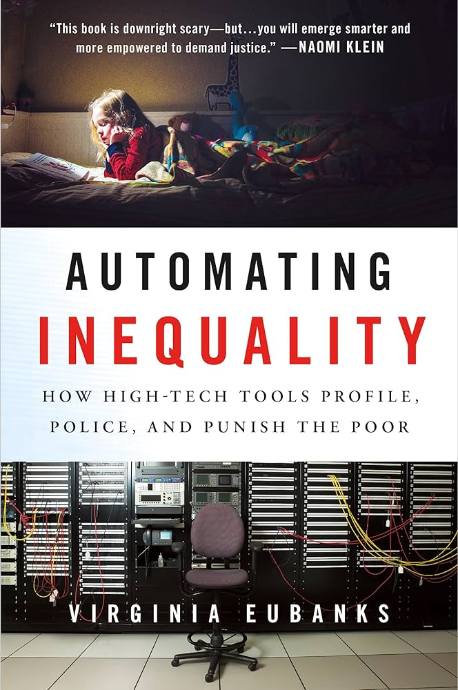{height=400}
:::
:::{.column width=32%}

<br>
<br>

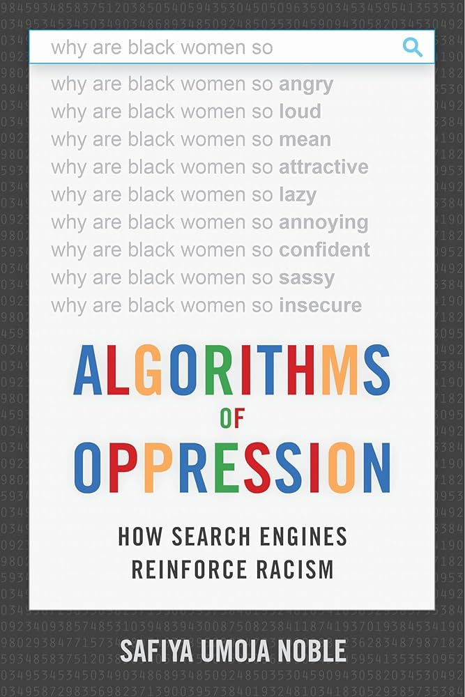{height=400}
:::
:::{.column width=32%}
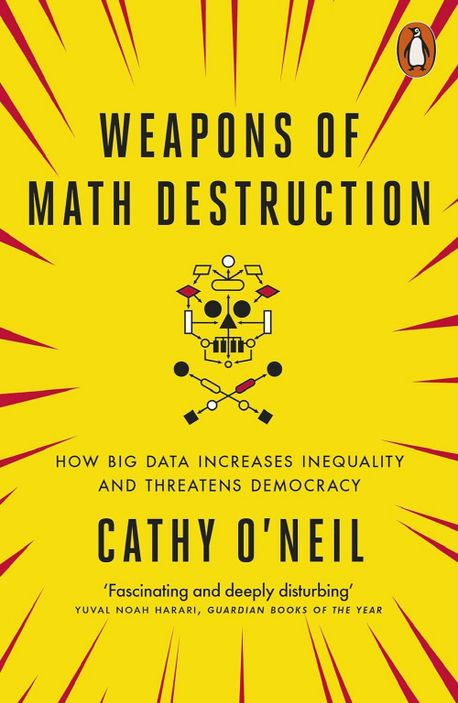{height=400}
:::
:::

## Be fair -- But what is fair?

:::{.columns}
:::{.column width=30%}
{height=400}
:::
:::{.column width=70%}
:::{.fragment}
If we google for "doctor", what fraction of the images should be female? 
[Asian?]{.fragment}
[female and Asian?]{.fragment}
:::
:::
:::

## Loan Threshold Activity 

:::{style="font-size: 80%"}
Imagine a machine learning algorithm that takes information about loan
applicants and assigns them a credit score from 0 to 100. The credit scores 
are not perfect, however. [Applicants with higher credit scores are more likely
to repay their loan, but some people with lower credit scores will repay loans,
and some with higher scores will not.]{.smaller}
:::

Your task is to devise a system that uses these credit scores to decide who gets
a loan.

:::{#exr-metrics}
How will you measure how "good" your system is? What sorts of things could
you measure/quantify as indication of how well your system works? We'll call those things metrics. Come up with at least 3 metrics.
:::

<!-- maximize profit -->
<!-- maximize correct decisions -->
<!-- maximize % of loans repaid -->

::: {#exr-compare-metrics}
Which of your metrics do you like better? Why?
:::

## Measuring Simple Classification

:::{.columns}
:::{.column}
```{r}
#| include: true
#| echo: false
library(tibble)
library(gt)
CM <- tibble(
  "actual" = c("A", "B"),
  a = c("TP = Aa", "FN = Ab"),
  b = c("FP = Ba", "TN = Bb")
)

CM |>
  gt() |>
  cols_align(align = "center") |>
  tab_spanner("predicted", a:b) |>
  opt_table_font(
    size = px(40),
    font = google_font(name = "Crimson Pro")
  )
# tab_style(
#   style = list(
#     cell_fill(color = "green"),
#   ),
#   locations = cells_body(i = j)
# )
```
:::
:::{.column}

A = repay loan (positive)

B = fail to repay loan (negative)

:::
:::

<br>

Accuracy = $\displaystyle \frac{Aa + Bb}{A + B}$ = proportion correct decisions

False positive rate = 
$\displaystyle \frac{Ba}{B}$ = 
prop. incorrect among B.

* Bank might want to keep this low.

## Measuring Fairness (Simple Classification)

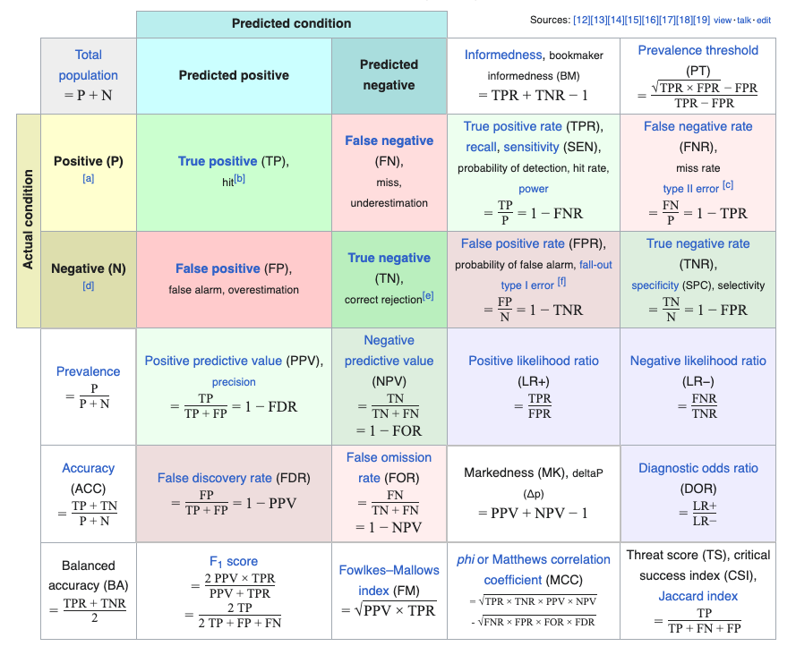

<!-- [Source: Wikipedia]{style="font-size: 70%"} -->

## Loan Threshold Activity (Interactive) 

There *was* a nice interactive website by Maritz Hardt that allowed 
students to experiment with different notions of fairness and different loan 
threshold policies based on 

* @Hardt:2016

* [Wayback machine version of activity](https://web.archive.org/web/20241120192635/http://research.google.com/bigpicture/attacking-discrimination-in-ml/)

## Fair = Equally good across groups

* Depends on which notion of "good" we use.

* Example: We might want the percentage
of people who would have repaid the loan
but were not given one to be the same
for two groups. 
[Equal incorrect denial rate.]

## Measuring Fairness

Loan Threshold activity seems to have been replaced with 
[this example](https://pair.withgoogle.com/explorables/measuring-fairness/)
based on medical testing rather than granting loans.

:::{.fragment}
#### Main take-aways are the same

* There are multiple ways to quantify "fairness".
* You can't achieve them all simultaneously.
* So the first step in being "fair" is to decide *what kind of fair?*
:::

## Interesting student comments

I had several students make comments that amounted to

<center>
_______ is fair for Group A, but not for Group B.
</center>

* Does this make sense?


## More about Fairness

#### [fairmlbook.org](https://fairmlbook.org), [fairmlclass.github.io](https://fairmlclass.github.io/)

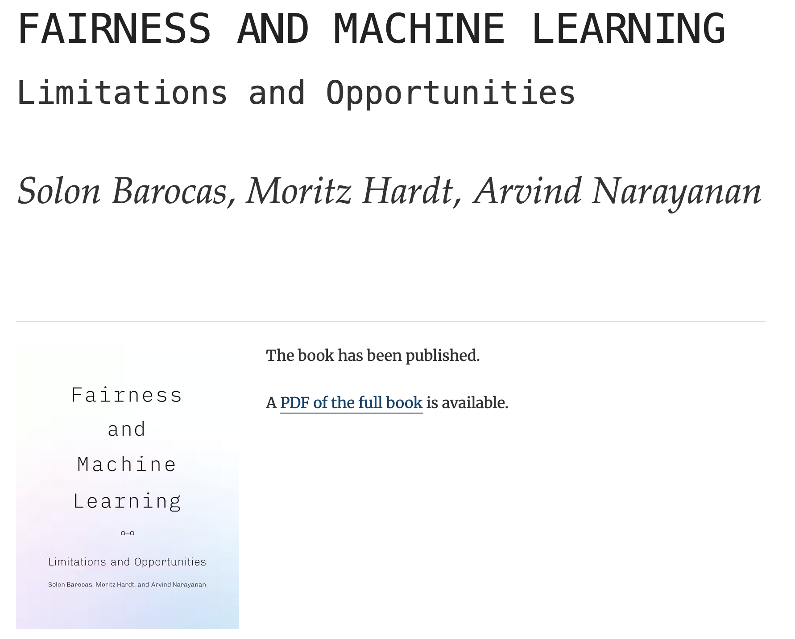


## (Have students) write good code

* @Pruim:2023
* @Norman:2012
* @Klanderman:2023

## 4 C's of Good Code

> These higher level goals take into account that 
**computer code simultaneously communicates both to humans and to the computer** 
and provide a framework for establishing a set of specific coding practices. 
(Pruim *et al*, 2023)

:::{.columns}
:::{.column}
1.  Correctness
2.  Clarity
:::
:::{.column}
3.  Containment
4.  Consistency
:::
:::


Elaborated with 10 guidelines for achieving these ends.


## But *WHY* write good code?

:::{.fragment}
*   **beauty** [(Vic Norman, 2012)](https://dl.acm.org/doi/pdf/10.1145/2077808.2077824)
    * See also @Oram:2007
:::

:::{.fragment}
*   **hospitality** [(Vic Norman, 2011)](https://cs.calvin.edu/documents/christian/TeachingHospitableCode.pdf)
:::

## Parting questions

:::{.incremental}
* What should be the mix of "big issues" and "daily ethical living" in our 
courses?

* Dedicated ethics courses (general or specific) vs. 
ethics integration into all/other courses?

* What might we have taught five years ago that would help our alumni navigate AI better now?

* What can we teach now that will help our future alumni deal with currently unforeseen
developments that require ethical thinking/action?


:::


## Thanks


## Norms for Stats and DS? {visibility="hidden"}

Dooywerd's aspects/norms
