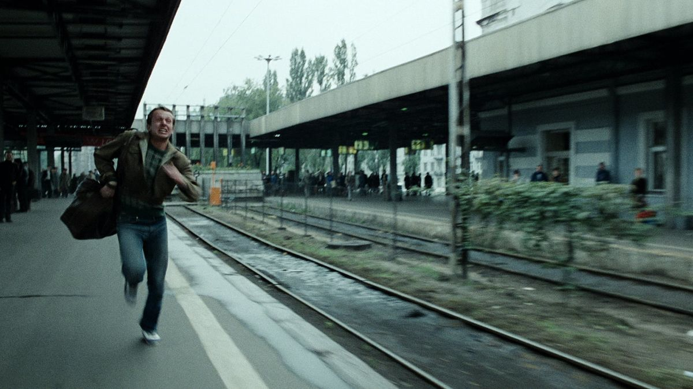

background-image: url(https://danielmiessler.com/images/ordered_chaos.png)


# Random Thoughts

```{r setup, include=FALSE}
options(htmltools.dir.version = FALSE)
knitr::opts_chunk$set(
  dev = 'svg',
  echo = FALSE)
library(ggformula)
library(patchwork)
```

???

Image credit: [credit](https://danielmiessler.com/images/ordered_chaos.png)

---

# Random Thoughts

### A few caveats before we begin ...

--

1. This is mostly a personal reflection.

--

2. Randomness is ~~Difficult~~ Challenging.

  a. technical challenges
  
  b. vocabulary challenges
  
  c. disciplinary challenges
--

3. Frustrating lack of methodology (for the questions I'm approaching).

  a. no theorems
  
  b. no data analysis
  
  c. no algorithms
  
  d. not clear other disciplines have what it takes either
  
 
---

# What is Randomness?

1. **Unpredictability** [Process Randomness]

--

  * A coin toss

--

2. **Unknowability** [Epistemological Randomness]

--

  * A different coin toss

--

3. **Incompressibility** [Descriptive Randomness]

--

    * The record of a a sequence of coin tosses:  

    ```
        TTHHTTHHTTHHHHHHHHTTTTTTTTHHTTHHHHTTHHHH
    ``` 


---
# What is Randomness?

1. **Unpredictability** [Process Randomness]

  * A coin toss

2. **Unknowability** [Ontological Randomness]

  * A different coin toss

3. **Incompressibility** [Descriptive Randomness]

    * The record of a a sequence of coin tosses:  

    ```
        TTHHTTHHTTHHHHHHHHTTTTTTTTHHTTHHHHTTHHHH
        T H T H T H H H H T T T T H T H H T H H
    ``` 

---
class: inverse, center, middle

# Fun and Games <br> (and Stories)

---

class: large

# A few notes about games

--

1. I have always liked playing games 

---

# A few notes about games

1. I have always liked playing games -- and it seems to be hereditary.


---

# A few notes about games


1. I have always liked playing games -- and it seems to be hereditary.

2. In our family, you play to win (but lose gracefully).

--

3. Randomness can balance the game.

--

```{r echo = FALSE, fig.width = 5, fig.height = 1.5, out.width = "100%", dev="svg"}
gf_text(0.6 ~ 0, label = 'Candy Land') %>%
  gf_text(1.3 ~ 0, label = 'War') %>%
  gf_text(0.6 ~ 2.6, label = 'Sorry') %>%
  gf_text(1.3 ~ 6, label = 'Mitternachtsparty (Hugo)') %>%
  gf_text(0.6 ~ 6, label = 'Cribbage') %>%
  gf_text(0.6~ 10, label = 'Chess') %>%
  gf_text(-0.6~ 10, label = '"less random"', size = 4) %>%
  gf_text(-0.6~ 0, label = '"more random"', size = 4) %>%
  gf_text(-1.4~ 10, label = 'more strategic', size = 3.5) %>%
  gf_text(-1.4~ 0, label = 'less strategic', size = 3.5) %>%
  gf_segment(0 + 0 ~ 5 + 10.2, color = "navy", 
             arrow = arrow(length = unit(0.10, "npc"))) %>%
  gf_segment(0 + 0 ~ 5 + -0.2, color = "navy", 
             arrow = arrow(length = unit(0.10, "npc"))) %>%
  gf_theme(theme_void()) %>%
  gf_lims(x = c(-1.5, 11), y = c(-1.7, 1.8))
```

---

# War and Candy Land

A completely random game is just a **slow way to flip a coin** 

* Not very interesting to play unless you just like to see how the randomness plays out (slowly).

<p class = "center">

</p>

---

# Sorry

```{r include = FALSE, echo = FALSE, out.width = "80%", fig.align = "center", error = TRUE}

```

<p class="center">

</p>

---
background-image: url(images/sorry-game-over-shoulder.jpg)

# Sorry

<!-- <p class="center"> -->
<!--  -->
<!-- </p> -->

```{r include = FALSE, out.width = "80%", fig.align = "center", error = TRUE}

```

---

# Midnightsparty (Hugo)

.pull-left30[
<p class = "center">

</p>
]

.pull-right65[
<p class = "center">

</p>
]


---

# Joseph Petrus Wergin

<p class = "center">

</p>

???

[cribbage hall of fame](http://www.cribbage.org/NewSite/hof/002_Wergin.asp)

[obit](https://www.findagrave.com/memorial/12342149/joseph-petrus-wergin)

---

# Random Life Events

<p class = "center middle">

</p>

---


# Random Life Events (in Movies)


.pull-left[

#### Blind Chance (Kieslowski, 1987)



* [Vimeo](https://vimeo.com/23284918) (three trains)
]

.pull-right[

#### Lola Rennt (Run Lola Run, 1998)


* [Trailer](https://www.youtube.com/embed/uz2-D4lY2qg?start=20)

#### Sliding Doors (1998)


* [YouTube](https://youtu.be/B6wJq9AZVfY) (two trains)
]

---
class: center middle

# Sliding Doors Train Scene

<iframe width="784" height="441" src="https://www.youtube.com/embed/B6wJq9AZVfY" frameborder="0" allow="accelerometer; autoplay; clipboard-write; encrypted-media; gyroscope; picture-in-picture" allowfullscreen></iframe>

<!-- --- -->

<!-- Lola Rennt (Run Lola Run) -->

<!-- <iframe width="784" height="441" src="https://www.youtube.com/embed/uz2-D4lY2qg?start=20" frameborder="0" allow="accelerometer; autoplay; clipboard-write; encrypted-media; gyroscope; picture-in-picture" allowfullscreen></iframe> -->

---

# Not your usual Sierpinski Triangles

```{r, fig.align = "center", fig.height = 6, fig.width = 14, include = FALSE, eval = FALSE}
D1 <- read.csv("../d1.csv")
D2 <- read.csv("../d2.csv")

gf_point(y ~ x, data = D1 %>% head(35000), size = 0.0005) %>%
  gf_theme(theme_void()) %>%
  gf_refine(coord_equal()) |
gf_point(y ~ x, data = D2 %>% head(35000), size = 0.0005) %>%
  gf_theme(theme_void()) %>%
  gf_refine(coord_equal()) 
```

.pull-left[

]
.pull-right[

]

<!--  -->

---

# Chaos Game

```{r fig.width = 7, fig.height = 3, include = FALSE, eval = FALSE}
gf_point(y ~ x, data = D1, size = 0.01, color = "gray50") %>%
  gf_path(y ~ x, data = D1[1:14,], size = 0.6, color = "red") %>%
  gf_point(y ~ x, data = D1[1:14,], size = 1.2, color = "red") %>%
  gf_refine(coord_equal()) %>%
  gf_theme(theme_void()) |
gf_point(y ~ x, data = D2, size = 0.01, color = "gray50") %>%
  gf_path(y ~ x, data = D2[1:14,], size = 0.6, color = "red") %>%
  gf_point(y ~ x, data = D2[1:14,], size = 1.2, color = "red") %>%
  gf_refine(coord_equal()) %>%
  gf_theme(theme_void())
```

.pull-left[

]
.pull-right[

]

<!--  -->

At each step:

* Pick a random corner of the triangle.
* Move half-way to that corner and place a dot.

---

# Some Big Questoins

1. Does God use randomness to achieve his purposes?

--

2. If so, does that change how we think about God (and ourselves)?

3. If not, why do random models do such a good job of explaining things?


---

# Does it Matter?

Does it matter how God relates to (apparent) randomness?

--

1. If things are not random, why do they behave that way?

    * Mediation of Christ: to make the world more liveable for humans?
    * Why doesn't God make different choices?
    
--

2. Life events

    * Lots
    * Coincidenes
    * Insurance
    
---

# A Thought Experiment

---

# Parting (random) thoughts

1. Most scientists using randomness in their models are doing because 
**random models work**, not because they have a particular 
philosophic/theological position.

--

2. **Randomness** can be used **creatively** to acheive desired ends.

    * Game design [Sorry, cribbage, etc.]
    * Quantum computation
    * Genetics?

--

3. Allowing **a role for randomness does not preclude a role for God**.

    * Personifying change doesn't bring clarity to the discussion.
    * Not God or chance, rather God via chance?

--

4. I prefer **symmetric interpretations** of randomness.

    * "God when it's good, random when it's bad" seems contrived.
    * It is easy to selectively choose our interpretation based on the situation.

---

# Thanks

Slides available at <https://rpruim.github.io/talks/>

*Randomness and God's Governance*

* [Biologos Blog](https://biologos.org/articles/randomness-and-gods-governance)

* [At Ministry Theorem](http://ministrytheorem.calvinseminary.edu/wp-content/uploads/2016/06/9_pruim.pdf)


