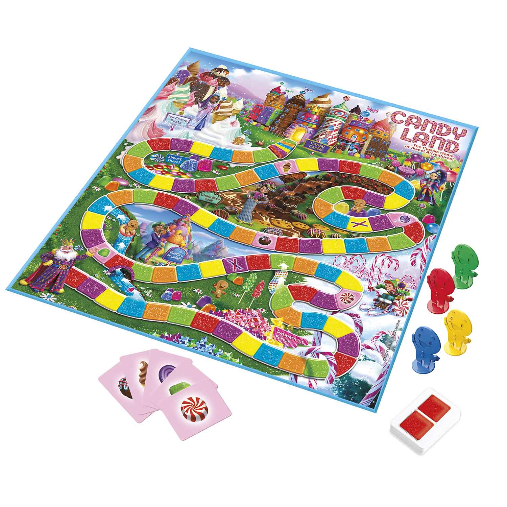

## Random Thoughts 


::: {.notes}
Image credit: [credit](https://danielmiessler.com/images/ordered_chaos.png)
:::

```{r setup, include=FALSE}
library(ggformula)
library(patchwork)
```


## Random Thoughts

### A few caveats before we begin ...

::: {.incremental}
1. This is mostly a personal reflection.
2. Randomness is [~~Difficult~~]{.strike} Challenging.
    a. technical challenges
    b. vocabulary challenges
    c. disciplinary challenges
3. Frustrating lack of methodology.
    a. no theorems, no data analysis, no algorithms
    b. not clear other disciplines have what it takes either
:::


## What is Randomness?

1. **Unpredictability** [Process Randomness]
    - A coin toss

. . .

2. **Unknowability** [Epistemological Randomness]
    - A different coin toss

. . .

3. **Incompressibility** [Descriptive Randomness]

    -   The record of a sequence of coin tosses:  
    
        `TTHHTTHHTTHHHHHHHHTTTTTTTTHHTTHHHHTTHHHH`

        :::{.fragment}

        `T H T H T H H H H T T T T H T H H T H H `

        :::


# Fun and Games <br> (and Stories)


## A few notes about games 

1. I have always liked playing games 
    - and it seems to be hereditary.

{width="35%" fig-align="center"}


## Randomness and Strategy

```{r fig.width = 8, fig.height = 1.5}
gf_text(0.6 ~ 0, label = 'Candy Land') |>
  gf_text(1.3 ~ 0, label = 'War') |>
  gf_text(0.6 ~ 2.6, label = 'Sorry') |>
  gf_text(1.3 ~ 6, label = 'Mitternachtsparty (Hugo)') |>
  gf_text(0.6 ~ 6, label = 'Cribbage') |>
  gf_text(0.6 ~ 10, label = 'Chess') |>
  gf_text(-0.6 ~ 10, label = '"less random"', size = 4) |>
  gf_text(-0.6 ~ 0, label = '"more random"', size = 4) |>
  gf_text(-1.4 ~ 10, label = 'more strategic', size = 3.5) |>
  gf_text(-1.4 ~ 0, label = 'less strategic', size = 3.5) |>
  gf_segment(
    0 + 0 ~ 5 + 10.2,
    color = "navy",
    linewidth = 1.7,
    arrow = arrow(length = unit(0.10, "npc"))
  ) |>
  gf_segment(
    0 + 0 ~ 5 + -0.2,
    color = "navy",
    linewidth = 1.7,
    arrow = arrow(length = unit(0.10, "npc"))
  ) |>
  gf_theme(theme_void()) |>
  gf_lims(x = c(-1.5, 11), y = c(-1.7, 1.8))
```


## War and Candy Land

A completely random game is just a **slow way to flip a coin** 

* Not very interesting to play unless you just like to see how the randomness 
plays out (slowly).

<center>
{width="70%"}
</center>


## Sorry


<p class="center">
{width=80%}
</p>


## Sorry

<p class="center">
{width=70%}
</p>


## Midnightsparty (Hugo)

:::{.columns}
:::{.column width=30%}
<p class = "center">
{width=80%}
</p>
:::
:::{.column width=65%}
<p class = "center">
{width=100%}
</p>
:::
:::


## Joseph Petrus Wergin

<center>
{width=40%}
</center>

:::{.notes}

[cribbage hall of fame](http://www.cribbage.org/NewSite/hof/002_Wergin.asp)

[obit](https://www.findagrave.com/memorial/12342149/joseph-petrus-wergin)

:::


# Beyond Games

## Joe

<p class = "center middle">
{width=40%}
</p>


## Random Life Events (in Movies)

:::{.columns}
:::{.column width=50%}

#### Blind Chance (Kieslowski, 1987)


* [Vimeo](https://vimeo.com/23284918) (three trains)
:::
:::{.column width=50%}

#### Lola Rennt (Run Lola Run, 1998)

{width=55%}

* [Trailer](https://www.youtube.com/embed/uz2-D4lY2qg?start=20)

#### Sliding Doors (1998)

{width=55%}

* [YouTube](https://youtu.be/B6wJq9AZVfY) (two trains)
:::
:::


## Sliding Doors Train Scene

<iframe width="784" height="441" src="https://www.youtube.com/embed/B6wJq9AZVfY" frameborder="0" allow="accelerometer; autoplay; clipboard-write; encrypted-media; gyroscope; picture-in-picture" allowfullscreen></iframe>

<!-- --- -->

<!-- Lola Rennt (Run Lola Run) -->

<!-- <iframe width="784" height="441" src="https://www.youtube.com/embed/uz2-D4lY2qg?start=20" frameborder="0" allow="accelerometer; autoplay; clipboard-write; encrypted-media; gyroscope; picture-in-picture" allowfullscreen></iframe> -->


## Not your usual Sierpinski Triangles

```{r, fig.align = "center", fig.height = 6, fig.width = 14, include = FALSE, eval = FALSE}
D1 <- read.csv("../d1.csv")
D2 <- read.csv("../d2.csv")

gf_point(y ~ x, data = D1 |> head(35000), size = 0.0005) |>
  gf_theme(theme_void()) |>
  gf_refine(coord_equal()) |
  gf_point(y ~ x, data = D2 |> head(35000), size = 0.0005) |>
    gf_theme(theme_void()) |>
    gf_refine(coord_equal())
```

:::{.columns}
:::{.column width=50%}
{width=87%}
:::
:::{.column width=50%}
{width=87%}
:::
:::

<!--  -->


## Chaos Game

```{r fig.width = 7, fig.height = 3, include = FALSE, eval = FALSE}
gf_point(y ~ x, data = D1, size = 0.01, color = "gray50") |>
  gf_path(y ~ x, data = D1[1:14, ], size = 0.6, color = "red") |>
  gf_point(y ~ x, data = D1[1:14, ], size = 1.2, color = "red") |>
  gf_refine(coord_equal()) |>
  gf_theme(theme_void()) |
  gf_point(y ~ x, data = D2, size = 0.01, color = "gray50") |>
    gf_path(y ~ x, data = D2[1:14, ], size = 0.6, color = "red") |>
    gf_point(y ~ x, data = D2[1:14, ], size = 1.2, color = "red") |>
    gf_refine(coord_equal()) |>
    gf_theme(theme_void())
```

:::{.columns}

:::{.column width=50%}
{width=87%}
:::
:::{.column width=50%}
{width=87%}
:::
:::

<!--  -->

At each step:

* Pick a random corner of the triangle.
* Move half-way to that corner and place a dot.


# Some Big Questions

## Some Big Questoins

1. Does God use randomness to achieve his purposes?

. . . 

2. If so, does that change how we think about God (and ourselves)?

3. If not, why do random models do such a good job of explaining things?


## Does it Matter?

Does it matter how God relates to (apparent) randomness?

. . .

**1.** If things are not random, why do they behave that way?

* To make the world more liveable for humans? (cf. D Laverell)
* Why doesn't God make different choices?
    
. . .

**2.** How do we interpret life events?

* Lots, Insurance, Lottery, Casinos, Coincidences

. . .

**3.** How much are we shaped by "random" things that happen in our lives?

. . .

* The three movies answer this question in different ways.
    

## Lucy and Maria Aylmer

<center>
{width=75%}
</center>


## A Thought Experiment


## Some Big Questions

1. Does God use randomness to achieve his purposes?

. . .

2. If so, does that change how we think about God (and ourselves)?

3. If not, why do random models do such a good job of explaining things?


## Parting (random) thoughts

::: {.incremental}
1. **Random models work**: Most scientists use them for utility, not philosophy.

2. **Creative Randomness**: It can achieve desired ends.

    * Game design [Sorry, cribbage, etc.]
    * Probabilistic Algorithms, Quantum Computation
    * Genetics?

3. **Coexistence**: A role for randomness does not preclude a role for God.

    * Personifying chance doesn't bring clarity to the discussion.
    * It's not "God xor chance", but is it "God via chance?"

4. **Symmetry**: I prefer symmetric interpretations over selective ones.

    * "God when it's good, random when it's bad" seems contrived.
    * It is easy to selectively choose our interpretation based on the situation.

:::


## Thanks

::: {.columns}
::: {.column width="60%"}
Slides available at <https://rpruim.github.io/talks/>

*Randomness and God's Governance* 

* [Biologos Blog](https://biologos.org/articles/randomness-and-gods-governance)

* [At Ministry Theorem](http://ministrytheorem.calvinseminary.edu/wp-content/uploads/2016/06/9_pruim.pdf)
:::

::: {.column width="40%"}
{width="45%"}
{width="45%"}
:::
:::
