## Random Thoughts 

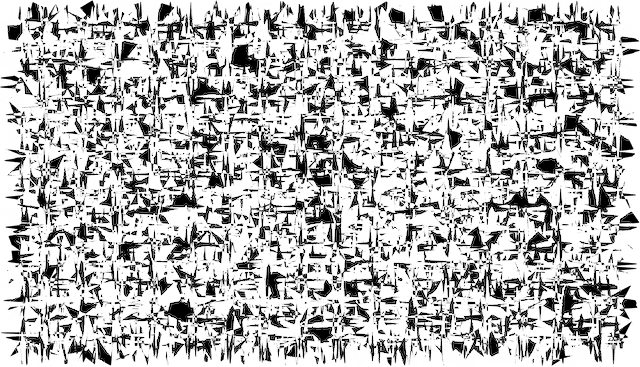

<!-- https://danielmiessler.com/images/ordered_chaos.png -->

```{r setup, include=FALSE}
options(htmltools.dir.version = FALSE)
library(ggformula)
library(patchwork)
```

[Image credit: <https://danielmiessler.com/images/ordered_chaos.png>]{.smaller}


## Random Thoughts

### A few caveats before we begin ...

:::{.incremental}

1.  Randomness is challenging.

    a. technical challenges
  
    b. vocabulary challenges
  
    c. disciplinary challenges

2.  Frustrating lack of methodology (for the questions I'm approaching).

    a. no theorems, no data analysis, no algorithms
  
    b. not clear other disciplines have what it takes either

<!-- 3.  This is mostly a personal reflection. -->

::: 


## What is Randomness?

:::{.incremental}
1. **Unpredictability** [Process Randomness]

    * A coin toss

2. **Unknowability** [Epistemological Randomness]

    * A different coin toss

3. **Incompressibility** [Descriptive Randomness]

    *   The record of a a sequence of coin tosses:  

        ```
          TTHHTTHHTTHHHHHHHHTTTTTTTTHHTTHHHHTTHHHH
        ```

        :::{.fragment}
        ```
          T H T H T H H H H T T T T H T H H T H H
        ``` 
        :::
:::

# Fun and Games <br> (and Stories)


## A few notes about games

. . .

1. I have always liked playing games 


## A few notes about games

1. I have always liked playing games -- and it seems to be hereditary.

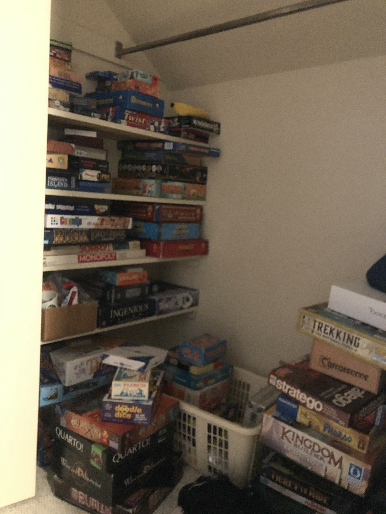{width=35%}


## A few notes about games


1. I have always liked playing games -- and it seems to be hereditary.

2. In our family, you play to win (but lose gracefully).

:::{.fragment}

3. Randomness can balance the game.

```{r echo = FALSE, fig.width = 5, fig.height = 1.5, out.width = "100%", dev="svg"}
gf_text(0.6 ~ 0, label = 'Candy Land') |>
  gf_text(1.3 ~ 0, label = 'War') |>
  gf_text(0.6 ~ 2.6, label = 'Sorry') |>
  gf_text(1.3 ~ 6, label = 'Mitternachtsparty (Hugo)') |>
  gf_text(0.6 ~ 6, label = 'Cribbage') |>
  gf_text(0.6 ~ 10, label = 'Chess') |>
  gf_text(-0.6 ~ 10, label = '"less random"', size = 4) |>
  gf_text(-0.6 ~ 0, label = '"more random"', size = 4) |>
  gf_text(-1.4 ~ 10, label = 'more strategic', size = 3.5) |>
  gf_text(-1.4 ~ 0, label = 'less strategic', size = 3.5) |>
  gf_segment(
    0 + 0 ~ 5 + 10.2,
    color = "navy",
    arrow = arrow(length = unit(0.10, "npc"))
  ) |>
  gf_segment(
    0 + 0 ~ 5 + -0.2,
    color = "navy",
    arrow = arrow(length = unit(0.10, "npc"))
  ) |>
  gf_theme(theme_void()) |>
  gf_lims(x = c(-1.5, 11), y = c(-1.7, 1.8))
```

:::

## War and Candy Land

A completely random game is just a **slow way to flip a coin** 

* Not very interesting to play unless you just like to see how the randomness plays out (slowly).

<p class = "center">
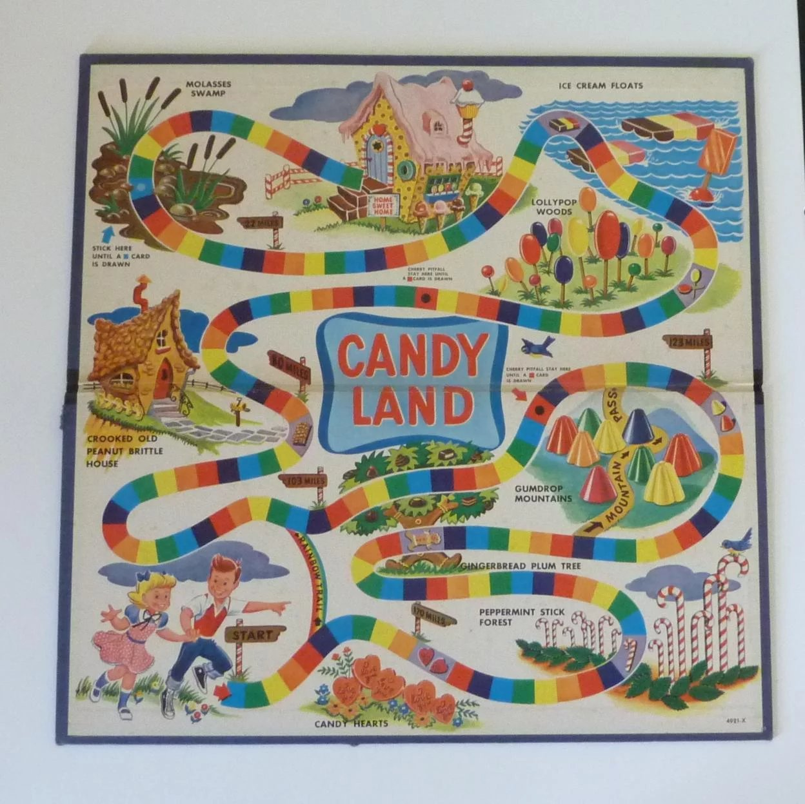{width=50%}
</p>


## Sorry


<p class="center">
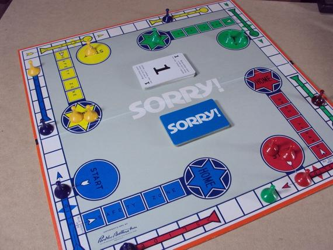{width=70%}
</p>


## Sorry

<p class="center"> -->
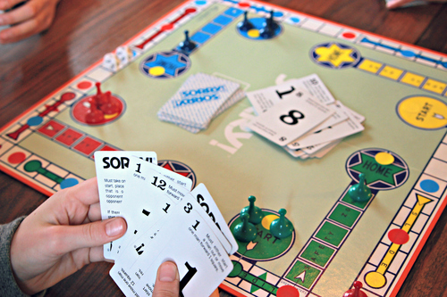{width=70%}
</p>

```{r include = FALSE, out.width = "80%", fig.align = "center", error = TRUE}

```


## Midnightsparty (Hugo)

:::{.columns}
:::{.column width=30%}
<p class = "center">
{width=80%}
</p>
:::
:::{.column width=65%}
<p class = "center">
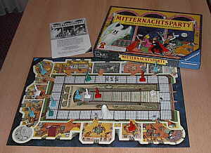{width=100%}
</p>
:::
:::


## Joseph Petrus Wergin

:::{.columns}
:::{.column width=35%}
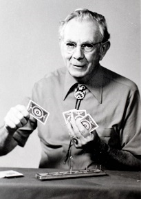{height=700}
:::
:::{.column width=30% .fragment}
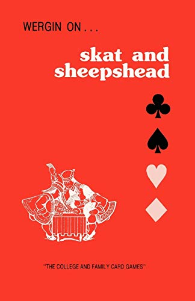{height=700}
:::

:::{.column width=30% .fragment}
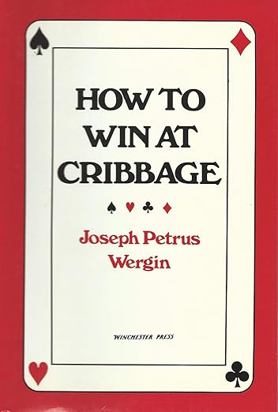{height=700}
:::
:::

:::{.notes}

* [cribbage hall of fame](http://www.cribbage.org/NewSite/hof/002_Wergin.asp)

* [obit](https://www.findagrave.com/memorial/12342149/joseph-petrus-wergin)

:::

# Beyond Games

## Random Life Events (in Movies)

:::{.columns}
:::{.column width=50%}

#### Blind Chance (Kieslowski, 1987)

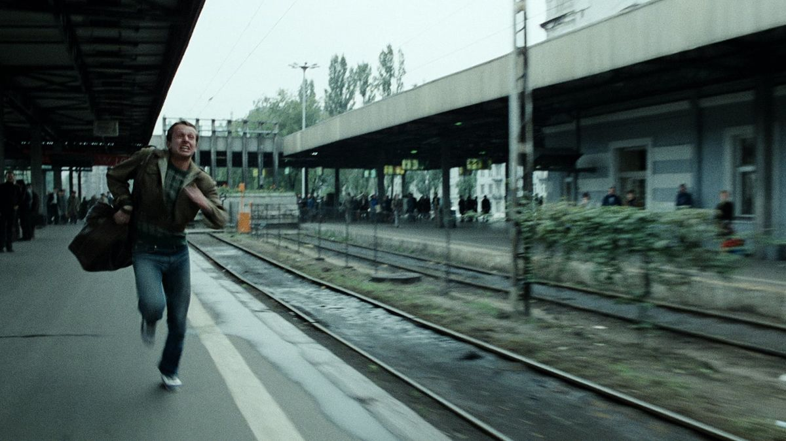

* [Vimeo](https://vimeo.com/23284918) (three trains)
:::
:::{.column width=50%}

#### Lola Rennt (Run Lola Run, 1998)

{width=55%}

* [Trailer](https://www.youtube.com/embed/uz2-D4lY2qg?start=20)

#### Sliding Doors (1998)

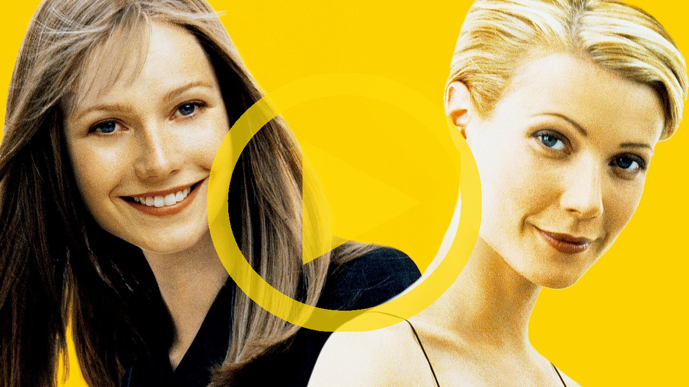{width=55%}

* [YouTube](https://youtu.be/B6wJq9AZVfY) (two trains)
:::
:::


## Sliding Doors Train Scene



<!-- <iframe width="784" height="441" src="https://www.youtube.com/embed/B6wJq9AZVfY" frameborder="0" allow="accelerometer; autoplay; clipboard-write; encrypted-media; gyroscope; picture-in-picture" allowfullscreen></iframe> -->

<!-- --- -->

<!-- Lola Rennt (Run Lola Run) -->

<!-- <iframe width="784" height="441" src="https://www.youtube.com/embed/uz2-D4lY2qg?start=20" frameborder="0" allow="accelerometer; autoplay; clipboard-write; encrypted-media; gyroscope; picture-in-picture" allowfullscreen></iframe> -->

## Joe

<p class = "center middle">
{width=40%}
</p>


## Not your usual Sierpinski Triangles

```{r, fig.align = "center", fig.height = 6, fig.width = 14, include = FALSE, eval = FALSE}
D1 <- read.csv("../d1.csv")
D2 <- read.csv("../d2.csv")

gf_point(y ~ x, data = D1 |> head(35000), size = 0.0005) |>
  gf_theme(theme_void()) |>
  gf_refine(coord_equal()) |
  gf_point(y ~ x, data = D2 |> head(35000), size = 0.0005) |>
    gf_theme(theme_void()) |>
    gf_refine(coord_equal())
```

:::{.columns}
:::{.column width=50%}
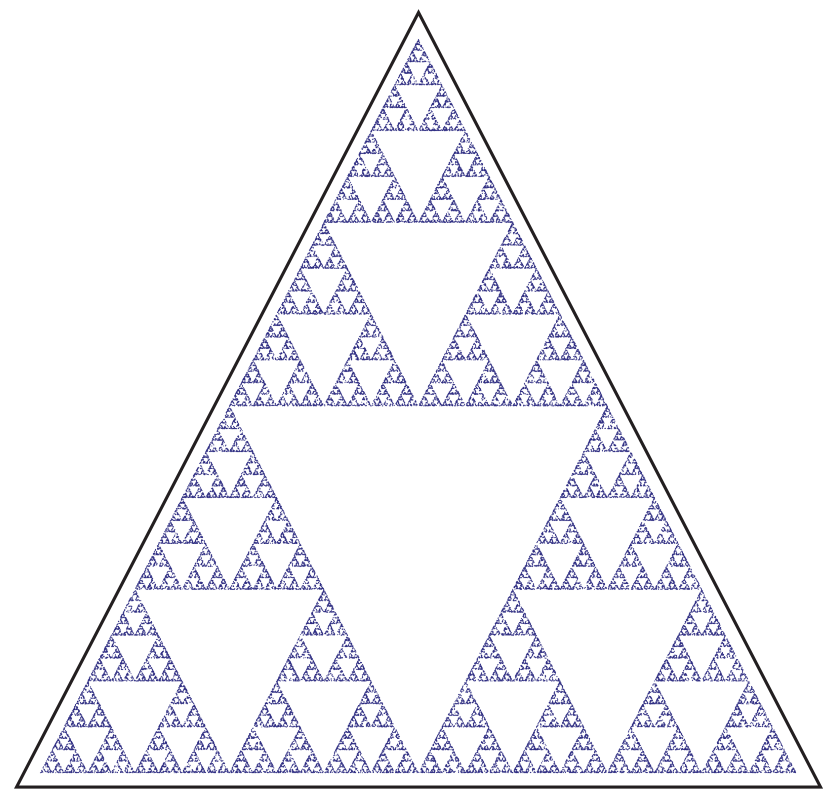{width=80%}
:::
:::{.column width=50%}
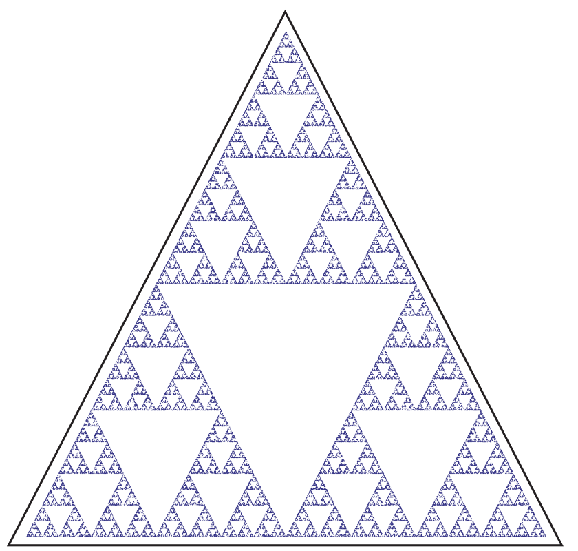{width=80%}
:::
:::


<!--  -->


## Chaos Game

```{r fig.width = 7, fig.height = 3, include = FALSE, eval = FALSE}
gf_point(y ~ x, data = D1, size = 0.01, color = "gray50") |>
  gf_path(y ~ x, data = D1[1:14, ], size = 0.6, color = "red") |>
  gf_point(y ~ x, data = D1[1:14, ], size = 1.2, color = "red") |>
  gf_refine(coord_equal()) |>
  gf_theme(theme_void()) |
  gf_point(y ~ x, data = D2, size = 0.01, color = "gray50") |>
    gf_path(y ~ x, data = D2[1:14, ], size = 0.6, color = "red") |>
    gf_point(y ~ x, data = D2[1:14, ], size = 1.2, color = "red") |>
    gf_refine(coord_equal()) |>
    gf_theme(theme_void())
```

:::{.columns}
:::{.column width=50%}
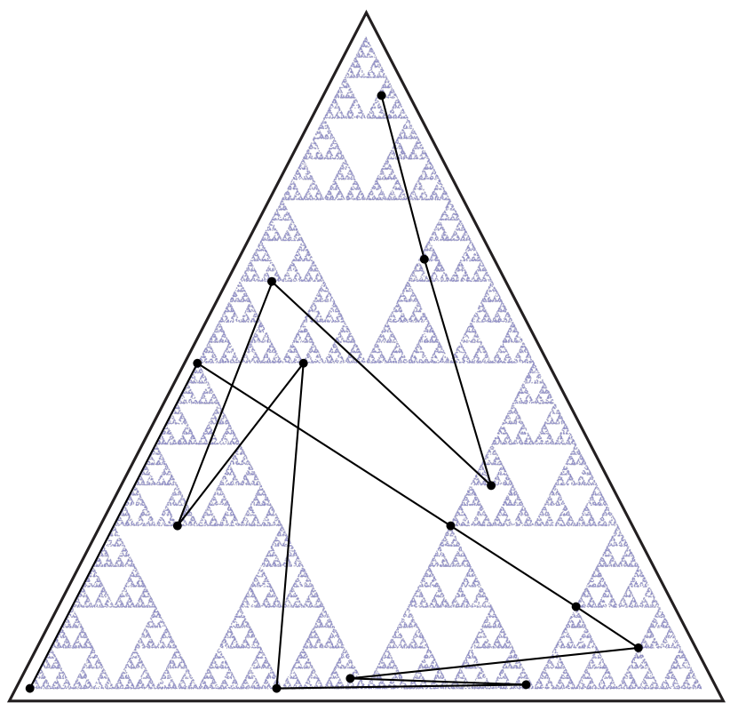{width=80%}
:::
:::{.column width=50%}
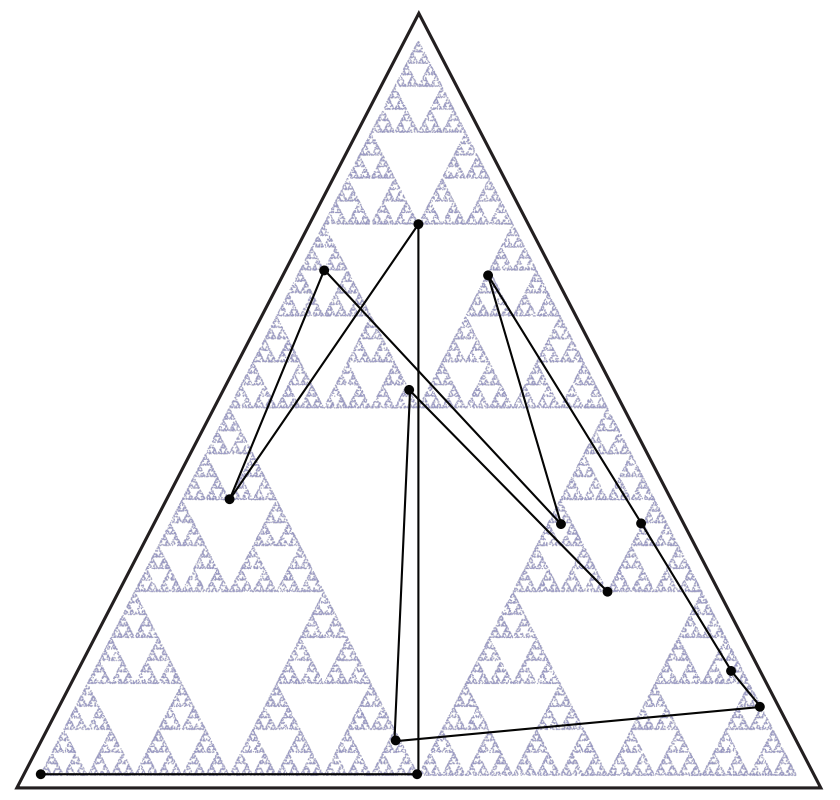{width=80%}
:::
:::

<!--  -->

At each step:

* Pick a random corner of the triangle.
* Move half-way to that corner and place a dot.


# Some Big Questions

## Some Big Questions{}

:::{.incremental}
1. Does God use randomness to achieve his purposes?

2. If so, does that change how we think about God (and ourselves)?

3. If not, why do random models do such a good job of explaining things?
 
4.  What about Proverbs 16:33?

:::

## Proverbs 

:::{.fragment}
#### Prov 16:31
Gray hair is a crown of glory; it is gained in a righteous life. 
:::

#### Prov. 16:33
The lot is cast into the lap,  
&nbsp; &nbsp; but its every decision is from the Lord.


## Ecclesiastes 9:11

:::{.fragment}

I have seen something else under the sun:    
&nbsp; &nbsp;The race is not to the swift  
&nbsp; &nbsp; &nbsp; &nbsp; or the battle to the strong,  
&nbsp; &nbsp; nor does food come to the wise  
&nbsp; &nbsp; &nbsp; &nbsp; or wealth to the brilliant  
&nbsp; &nbsp; &nbsp; &nbsp; &nbsp; &nbsp; or favor to the learned;  
&nbsp; &nbsp; but **time and chance happen to them all**. 
:::


## Does it Matter? 

Does it matter how God relates to (apparent) randomness?

:::{.incremental}

1.  If things are not random, why do they behave that way?

    * To make the world more liveable for humans? (cf. D Laverell)
    * Why doesn't God make different choices?
    

2.  How do we interpret life events?

    * [Coincidences]{.fragment}[, Lots]{.fragment}[, Lottery]{.fragment}[, Casino]{.fragment}[, Insurance]{.fragment}[, etc.]{.fragment}


3.  How much are we shaped by "random" things that happen in our lives?

    * The three movies answer this question in different ways.
:::

:::{.fragment}
<p class = "center">
{width=25%}
</p>

:::


## A Thought Experiment


## Parting (random) thoughts

**1.** Most scientists using randomness in their models are doing because 
**random models work**, not because they have a particular 
philosophic/theological position.

. . .

**2.** **Randomness** can be used **creatively** to acheive desired ends.

* Game design [Sorry, cribbage, etc.]
* Probabilistic Algorithms, Quantum Computation
* Genetics?

. . .

**3.** Allowing **a role for randomness does not preclude a role for God**.

* Personifying chance doesn't bring clarity to the discussion.
* It's not "God xor chance!", rather "God via chance?"

. . .

**4.** I prefer **symmetric interpretations** of randomness.

* "God when it's good, random when it's bad" seems contrived.
* It is easy to selectively choose our interpretation based on the situation.


## Thanks

:::{.columns}
::::{.column width=50%}
Slides available at <https://rpruim.github.io/talks/>

*Randomness and God's Governance* 

* [Biologos Blog](https://biologos.org/articles/randomness-and-gods-governance)

* [At Ministry Theorem](http://ministrytheorem.calvinseminary.edu/wp-content/uploads/2016/06/9_pruim.pdf)

    * Includes a reading list.

[*Randomness and God's Nature*](https://www.gvsu.edu/cms4/asset/843249C9-B1E5-BD47-A25EDBC68363B726/bradleychance.pdf) by Jim Bradley
:::

:::{.column width=50%}
<p class = "center">
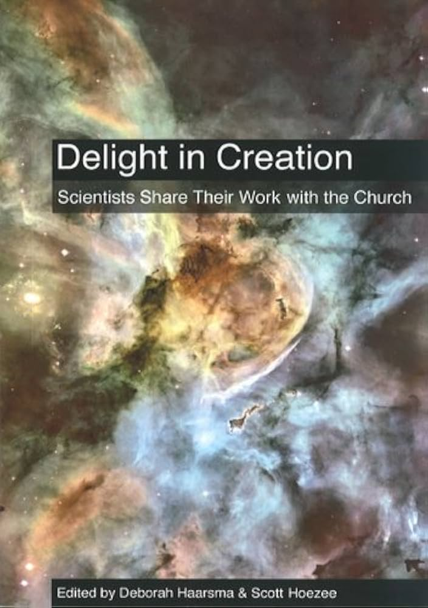{height=400}
&nbsp;
&nbsp;
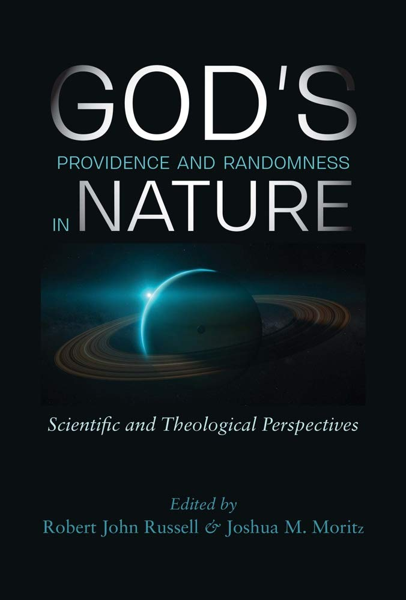{height=400}
</p>
:::
:::


## Webster {visibility="hidden"}

**random**

: *adj*, lacking a definite plan, purpose, or pattern.
: *adj*, relating to, having, or being elements or events with definite probability of occurrence.

## Bible passages  {visibility="hidden"}

* Genesis 1:1 -- In the beginning, God created the 
heavens and the earth. (ESV)

* John 1:3 --  All things were made through him, and without him was not any thing made that was made. (ESV)

* Prov. 16:31-33 -- Gray hair is a crown of glory;
    it is gained in a righteous life.
Whoever is slow to anger is better than the mighty,
    and he who rules his spirit than he who takes a city.
The lot is cast into the lap,
    but its every decision is from the Lord. (ESV)

*   Eccl 9:11 --  I have seen something else under the sun:

    The race is not to the swift  
    &nbsp; &nbsp; or the battle to the strong,  
    nor does food come to the wise  
    &nbsp; &nbsp; or wealth to the brilliant  
    &nbsp; &nbsp;&nbsp; &nbsp; favor to the learned;  
    but time and chance happen to them all. (NIV)

## References